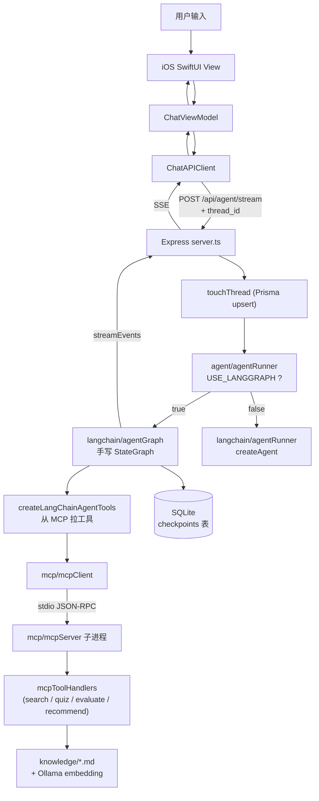

# AI iOS Chat Demo


一个用于学习的 AI 聊天 Demo，从最朴素的"模型直答"一路演进到"带工具、带 RAG、带持久化、带 LangGraph 状态机"的完整 Agent 系统。

- `ios/ChatAI-iOS`：SwiftUI iOS App（带对话列表、流式气泡、工具进度展示）
- `backend-node`：Node.js + Express + LangChain + LangGraph + MCP 后端

当前默认调用流程：

```text
iOS SwiftUI（对话列表 + 聊天页）
  -> POST /api/agent/stream (带 thread_id)
  -> Node.js Express 路由
  -> Phase 4 LangGraph StateGraph（或 Phase 3 createAgent，灰度切换）
  -> agentNode → toolNode → agentNode（ReAct 循环）
  -> LangChain Tools（从 MCP 动态加载）
  -> MCP Client → MCP Server 子进程（stdio JSON-RPC）
  -> 真实工具（searchKnowledge / generateQuiz / evaluateAnswer / recommendNextTopic）
  -> ChatDeepSeek
  -> SqliteCheckpointer 自动存档 state
  -> Node.js 通过 SSE 返回工具事件 + 最终文本片段
  -> iOS 实时更新同一条 AI 消息气泡
```

项目里也保留了：

- `/api/chat/stream`：普通流式接口（固定 RAG，无工具，对比用）
- `/api/chat`：非流式结构化 JSON 接口（最早期版本）

方便对比不同阶段的实现差异。

---

## Phase 演进历史

这个项目是按 Phase 渐进推进的，每个 Phase 都是一个完整的学习阶段：

| Phase | 主要内容 | 关键文件 |
|-------|---------|---------|
| Phase 1 | 最基础的 OpenAI 兼容直答 | `chat/*` |
| Phase 2 | 接入 LangChain + RAG 知识库 | `langchain/ragRetriever.ts` |
| Phase 3 | LangChain `createAgent` + MCP 工具 | `langchain/agentRunner.ts` |
| Phase 4 | 手写 LangGraph StateGraph（替代 createAgent） | `langchain/agentGraph*.ts` |
| Phase 5 | Prisma + SqliteCheckpointer 持久化对话 | `db/*` |
| Phase 5.6 | iOS 对话列表 UI | `Views/ThreadListView.swift` |
| Phase 6 | Ollama 真实 Embedding + 向量缓存 | `langchain/embeddings.ts` `langchain/ragCache.ts` |
| Phase 7 | 工具集扩展到 4 个（LLM-as-judge + 学习规划） | `mcp/mcpToolHandlers.ts` |
| Phase 10 | 生产化：LangSmith trace + Eval + CI/CD + 安全加固 + Docker | `langsmithClient.ts` `evals/` `Dockerfile` |

Phase 3 和 Phase 4 通过 `USE_LANGGRAPH` 环境变量灰度切换，行为完全等价。

---

## 1. 启动后端

### 1.1 基础步骤

```bash
cd backend-node
cp .env.example .env
```

在 `.env` 里至少填入真实的 `DEEPSEEK_API_KEY`。

```bash
npm install
```

### 1.2 初始化数据库（Phase 5 新增）

Phase 5 引入了 Prisma + SQLite 持久化对话。首次启动前必须跑 migration：

```bash
npx prisma migrate dev
```

这一步会做三件事：

```text
1. 在 backend-node/prisma/ 下创建 dev.db SQLite 文件
2. 应用 migrations/ 里的所有 SQL（建 threads 表）
3. 生成 @prisma/client TypeScript 客户端
```

LangGraph 的 `SqliteCheckpointer` 会使用同一个 `dev.db` 文件，
但 `checkpoints` / `writes` / `checkpoint_blobs` 这些表是它运行时自动建的，
Prisma 不管它们。

### 1.3（可选）安装 Ollama 跑真实 embedding

Phase 6 后默认的 embedding provider 是 `local-keyword`（不需要任何外部依赖，
适合零配置跑通）。如果想体验真实语义向量检索，安装本地 Ollama：

```bash
# macOS
brew install ollama
ollama serve &
ollama pull bge-m3
```

然后在 `.env` 里把 embedding provider 切到 ollama：

```text
EMBEDDINGS_PROVIDER=ollama
OLLAMA_BASE_URL=http://127.0.0.1:11434
OLLAMA_EMBEDDING_MODEL=bge-m3
```

切换后第一次 Agent 请求会触发向量构建（约 30-50 个 chunk × 几十毫秒），
之后会被 `.rag-cache/vectors.json` 缓存下来，重启进程后秒级加载。

### 1.4 启动开发服务

```bash
npm run dev
```

后端默认地址：

```text
http://127.0.0.1:8000
```

健康检查：

```bash
curl http://127.0.0.1:8000/health
```

启动后控制台会打印一行 LangSmith 状态：

```text
[LangSmith] tracing disabled (set LANGSMITH_TRACING=true to enable)
```

接入 LangSmith 是 Phase 10 的事，详见 `.env.example` 里的注释。

---

## 2. 运行 iOS App

用 Xcode 打开：

```text
ios/ChatAI-iOS/ChatAI-iOS.xcodeproj
```

选择 iOS 模拟器运行即可。

iOS 端后端地址配置在：

```text
ios/ChatAI-iOS/ChatAI-iOS/Core/AppConfig.swift
```

模拟器调试时可以使用：

```text
http://127.0.0.1:8000
```

真机调试时需要改成 Mac 的局域网 IP，例如：

```text
http://192.168.1.23:8000
```

### Phase 5.6 后的 iOS 主要界面

```text
ThreadListView（对话列表）
  -> 显示所有历史对话（按最近活跃倒序）
  -> 滑动可删除
  -> 点击进入 ChatView
  -> 顶部"新建"按钮可开始新对话

ChatView（聊天页）
  -> 流式气泡
  -> 工具进度（"正在查询知识库..." → "已查询知识库，找到 N 条相关资料"）
  -> 切换对话后自动从后端拉历史
```

---

## 3. 注意事项

- 不要提交 `backend-node/.env`
- 不要提交 `backend-node/node_modules`
- 不要提交 `backend-node/prisma/dev.db`（已在 `.gitignore`）
- 不要提交 `backend-node/.rag-cache/`（已在 `.gitignore`）
- 不要提交 Xcode 的 `xcuserdata`
- 可以提交 `backend-node/.env.example`
- 必须提交 `backend-node/prisma/migrations/`（别人 clone 后才能重建数据库）

---

## 4. RAG 知识库

知识库文档放在：

```text
backend-node/knowledge/
```

当前 RAG 已经接入 LangChain：

```text
用户提问
  -> LangChain DirectoryLoader / TextLoader 读取 Markdown
  -> RecursiveCharacterTextSplitter（markdown 模式）切 chunk
  -> Embeddings 生成向量（local-keyword 或 Ollama）
  -> MemoryVectorStore 做相似度检索
  -> 命中的 chunk 作为工具结果交回 Agent
  -> ChatDeepSeek 基于结果生成回答
  -> Node.js 通过 SSE 返回给 iOS
```

新增知识时，往 `backend-node/knowledge/` 里添加 `.md` 文件即可。

### 4.1 本地调试检索结果

```bash
cd backend-node
npm run rag:debug -- "SwiftUI @State 和 @Binding 有什么区别"
```

这条命令不会调用 DeepSeek，只检查 LangChain 的 loader、splitter、embedding、vector store 和 retriever 是否命中正确资料。

### 4.2 Embedding Provider 切换

```text
EMBEDDINGS_PROVIDER=local-keyword     # 默认，零依赖，关键词 hash 成伪向量
EMBEDDINGS_PROVIDER=ollama            # 真实语义向量，需要本地 Ollama
```

切换 provider 后，向量缓存会自动失效重建（缓存指纹包含 embedding 标识）。
详见 `backend-node/src/langchain/ragCache.ts`。

### 4.3 RAG 调参

```text
RAG_TOP_K=5            每次给模型多少段资料
RAG_CHUNK_SIZE=1200    切分大小
RAG_CHUNK_OVERLAP=160  相邻 chunk 的重叠范围
RAG_MIN_SIMILARITY=0.08  分数下限，太低的不送进模型
```

---

## 5. 后端代码结构

```text
backend-node/src/server.ts
  Express 路由、SSE 连接、服务启动、对话 CRUD 接口

backend-node/src/config/env.ts
  读取和校验 .env 配置

# Chat 模块（普通聊天）
backend-node/src/chat/chatCompletion.ts
  普通聊天接口的 LangChain RAG 上下文组装
backend-node/src/chat/chatHistory.ts
  清洗 history，限制历史长度
backend-node/src/chat/prompts.ts
  结构化输出、普通流式输出、Agent 的 prompt 规则（Phase 7 重构）
backend-node/src/chat/structuredAnswer.ts
  解析 /api/chat 的结构化 JSON 回答

# Knowledge / RAG 模块
backend-node/src/knowledge/knowledge.ts
  知识库外观层
backend-node/src/langchain/documentLoader.ts
  使用 DirectoryLoader / TextLoader 读取 Markdown
backend-node/src/langchain/embeddings.ts
  Embeddings 工厂（local-keyword / Ollama 切换）
backend-node/src/langchain/localEmbeddings.ts
  本地学习版关键词向量
backend-node/src/langchain/ragRetriever.ts
  TextSplitter + MemoryVectorStore + similarity search 主链路
backend-node/src/langchain/ragCache.ts
  Phase 6.4 向量缓存（指纹 + JSON 持久化）
backend-node/src/langchain/ragDebug.ts
  RAG 调试脚本

# Chat Model 封装
backend-node/src/langchain/chatModel.ts
  创建 LangChain ChatDeepSeek，封装 invoke / stream
backend-node/src/langchain/chatPrompt.ts
  ChatPromptTemplate 工具函数

# Agent 路由层（Phase 4 灰度入口）
backend-node/src/agent/agentRunner.ts
  根据 USE_LANGGRAPH 切换 Phase 3 / Phase 4 实现
backend-node/src/agent/agentTools.ts
  Agent SSE 工具事件辅助（tool_start / tool_done 文案）
backend-node/src/agent/agentToolTypes.ts
  Agent 工具结果类型 + 校验函数
backend-node/src/agent/agentObservability.ts
  结构化日志（按 requestId trace 整条链路）

# Phase 3 路径（LangChain createAgent）
backend-node/src/langchain/agentRunner.ts
  createAgent + middleware（retry / callLimit / toolCallLimit）
backend-node/src/langchain/agentTools.ts
  MCP tools → LangChain tools 桥接
backend-node/src/langchain/agentDebug.ts
  Agent 本地调试脚本

# Phase 4 路径（手写 LangGraph StateGraph）
backend-node/src/langchain/agentGraphState.ts
  State schema（messages + modelCallCount + toolCallCount）
backend-node/src/langchain/agentGraphNodes.ts
  agentNode、toolNode、shouldContinue 条件边
backend-node/src/langchain/agentGraph.ts
  组装 StateGraph、挂 checkpointer、streamEvents

# MCP（工具协议层）
backend-node/src/mcp/mcpServer.ts
  本地 MCP server，通过 stdio 暴露 4 个工具
backend-node/src/mcp/mcpClient.ts
  本地 MCP client，启动子进程 + listTools + callTool
backend-node/src/mcp/mcpToolHandlers.ts
  4 个工具的真实业务实现
backend-node/src/mcp/generateQuizDebug.ts
backend-node/src/mcp/evaluateAnswerDebug.ts
backend-node/src/mcp/recommendNextTopicDebug.ts
  工具独立调试脚本

# Phase 5 持久化
backend-node/prisma/schema.prisma
  Prisma 数据库设计图（threads 表）
backend-node/src/db/prisma.ts
  Prisma client 单例
backend-node/src/db/sqliteCheckpointer.ts
  LangGraph SqliteSaver 单例工厂
backend-node/src/db/threadsRepository.ts
  对话 CRUD 业务封装（跨 Prisma + checkpointer 两层）
backend-node/src/db/prismaDebug.ts
  Prisma 调试脚本

# Phase 10 LangSmith + Eval
backend-node/src/langchain/langsmithClient.ts
  LangSmith Client 单例 + submitUserFeedback()
backend-node/evals/
  自动评测体系（详见 evals/README.md）
  evals/datasets/qa.jsonl        21 条评测用例（7 场景 × 3 条）
  evals/lib/types.ts             核心类型（EvalCase / EvalResult / Evaluator）
  evals/lib/dataset.ts           数据集加载器（jsonl → EvalCase[]）
  evals/lib/runAgent.ts          Agent 纯函数包装（绕过 HTTP 直接调）
  evals/evaluators/              4 个评分器（toolChoice / keyword / toolChain / llmJudge）
  evals/runEval.ts               主入口（读数据集 → 跑 Agent → 评分 → 出报告）

# Phase 10.4 生产化
backend-node/Dockerfile
  多阶段构建（builder 编译 + runner 只跑 JS）
backend-node/.dockerignore
  Docker 构建时忽略的文件
docker-compose.yml
  编排配置（端口 / 环境变量 / 数据卷 / 重启策略）
.github/workflows/ci.yml
  GitHub Actions CI（tsc 检查 + eval 快速检查 + PR 自动评论）

# 通用
backend-node/src/http/sse.ts
  统一写 SSE event
backend-node/src/shared/types.ts
  后端共享类型（含 SSE 事件 token 用量字段）
```

拆分后的职责关系：

```text
server.ts
  -> 普通聊天：chat/* -> knowledge/* -> langchain/* -> http/*
  -> Agent 聊天：agent/agentRunner（灰度）
                  ├── Phase 3: langchain/agentRunner（createAgent）
                  └── Phase 4: langchain/agentGraph*（手写 StateGraph）
                                  └── db/sqliteCheckpointer（持久化）
  -> 工具：agent/* -> mcp/* -> 真实工具实现
  -> 对话管理：db/threadsRepository -> prisma + checkpointer 双源
  -> 共用：config/* + shared/*
```

---

## 6. 多轮上下文与持久化（Phase 5）

### 6.1 持久化模式（当前默认）

```text
iOS 第一次发消息时：
  POST /api/threads → 后端建一行 threads 记录 → 返回 thread.id

iOS 后续每次发消息：
  POST /api/agent/stream { message, thread_id }
  history 字段固定传空数组

后端拿到 thread_id：
  touchThread(threadId)            ← upsert + 刷新 updatedAt
  graph.streamEvents(...,
    { configurable: { thread_id }})
  ↑ 关键：LangGraph 用 SqliteSaver 自动从 checkpoint 加载历史 state，
    跑完图后又把新 state 写回 checkpoint
```

iOS 端 history 不再带，整段对话历史**完全由后端 checkpointer 管理**。这样：

- 用户切换设备能接上（id 在云端）
- 关闭 App 重开能接上
- 单条请求的 payload 永远很小

### 6.2 无持久化模式（兼容老接口）

如果不传 `thread_id`，后端走 Phase 4 老行为：

```text
state 是临时的（每次请求白板从空开始）
iOS 必须自己带 history
图跑完 state 立刻丢弃
```

主要给：
- 老版本 iOS 兼容
- 不需要"对话连续性"的一次性问答
- 自动化测试

### 6.3 对话 CRUD 接口

```text
POST   /api/threads               新建对话（body 可选 title）
GET    /api/threads               列出所有对话（按 updatedAt 倒序）
GET    /api/threads/:id/messages  拉某对话的可展示消息（过滤内部消息）
DELETE /api/threads/:id           删除对话（同时清掉 checkpointer state）
```

返回 `messages` 时已经过滤掉了 Agent 内部消息（tool_calls 中间消息、ToolMessage），
iOS 只看到 user / assistant 的真实对话。

详见 `backend-node/src/db/threadsRepository.ts`。

---

## 7. 流式输出

### 7.1 三个接口对比

```text
POST /api/chat
  -> 等 AI 完整返回
  -> 后端解析结构化 JSON（title/summary/points/next_question）
  -> iOS 展示卡片

POST /api/chat/stream
  -> 固定 RAG（不走 Agent）
  -> AI 边生成边返回
  -> 后端通过 SSE 推送 delta
  -> iOS 实时更新普通文本气泡

POST /api/agent/stream     ★ 当前 iOS 默认入口
  -> Agent 决定是否调工具（最多 N 轮 ReAct 循环）
  -> SSE 推送 tool_start / tool_done / delta / done
  -> iOS 显示工具进度 + 流式回答
  -> 带 thread_id 时自动持久化
```

### 7.2 SSE 事件格式

每行 `data:` 后面跟 JSON：

```text
data: {"type":"tool_start","tool_call_id":"call_xxx","tool_name":"searchKnowledge","display_name":"查询知识库","message":"正在查询知识库","request_id":"req_xxx","phase":"tool_execution"}

data: {"type":"tool_done","tool_call_id":"call_xxx","tool_name":"searchKnowledge","display_name":"查询知识库","ok":true,"message":"已查询知识库，找到 2 条相关资料","duration_ms":213,"request_id":"req_xxx","phase":"tool_execution"}

data: {"type":"delta","delta":"SwiftUI ","request_id":"req_xxx","phase":"final_stream"}

data: {"type":"delta","delta":"里的 @State ","request_id":"req_xxx","phase":"final_stream"}

data: {"type":"done","request_id":"req_xxx","phase":"request_completed","duration_ms":3421,"prompt_tokens":1200,"completion_tokens":350,"total_tokens":1550}
```

iOS 解析：

```text
tool_start：在当前 AI 气泡里显示"正在 xxx"
tool_done：更新成"已 xxx，结果摘要"
delta：追加到同一条 AI 气泡的 content
done：结束本次回答（附带 run_id + token 用量统计）
error：显示错误提示
```

### 7.3 iOS 流式更新模式

ViewModel 先 append 一条空 assistant 消息，记下它的 id，
每收到 delta 就根据 id 替换它的 content。这样列表始终保持
"用户一条 / AI 一条"的清晰结构，而不是变成"AI 片段 1、AI 片段 2..."。

### 7.4 手动测试

```bash
# 普通流式（无 Agent）
curl -N -X POST http://127.0.0.1:8000/api/chat/stream \
  -H "Content-Type: application/json" \
  -d '{"message":"SwiftUI 的 @State 是什么？","system_prompt":"","history":[]}'

# Agent 流式（无持久化）
curl -N -X POST http://127.0.0.1:8000/api/agent/stream \
  -H "Content-Type: application/json" \
  -d '{"message":"SwiftUI 的 @State 是什么？请先查知识库再回答","system_prompt":"","history":[]}'

# Agent 流式 + 持久化（先建 thread 再用 thread_id 发消息）
THREAD_ID=$(curl -s -X POST http://127.0.0.1:8000/api/threads \
  -H "Content-Type: application/json" -d '{}' | jq -r .id)
curl -N -X POST http://127.0.0.1:8000/api/agent/stream \
  -H "Content-Type: application/json" \
  -d "{\"message\":\"你好\",\"system_prompt\":\"\",\"history\":[],\"thread_id\":\"$THREAD_ID\"}"

# 拉历史看是否被存进 checkpointer
curl http://127.0.0.1:8000/api/threads/$THREAD_ID/messages
```

`-N` 是关闭 curl 输出缓冲，否则看不到实时流式效果。

---

## 8. Agent / Tool / MCP

### 8.1 整体调用链

```text
iOS 发送 message + thread_id
  -> Node.js touchThread + 启动 Agent
  -> 从 MCP server 拉工具列表（缓存）
  -> 把 MCP tools 包装成 LangChain tools
  -> agent/agentRunner 根据 USE_LANGGRAPH 选实现：
       Phase 3：LangChain createAgent（带 middleware）
       Phase 4：手写 StateGraph（agent ↔ tools ↔ shouldContinue）
  -> 模型在 ReAct 循环里决定是否调工具
  -> Tool wrapper 发 SSE tool_start → 调 MCP → 发 tool_done
  -> 工具结果作为 ToolMessage 加入 state
  -> 模型基于工具结果继续推理
  -> 最终回答 token 通过 SSE delta 推回 iOS
  -> Phase 4 路径：自动写回 SqliteCheckpointer
```

完整图：



### 8.2 Tool Calling 是什么

模型并不真的执行代码，它只会返回类似下面的结构化请求：

```json
{
  "name": "searchKnowledge",
  "arguments": { "query": "SwiftUI @State" }
}
```

真正执行工具的是后端的 LangChain Tool wrapper → MCP Server。
这样的好处是：

```text
模型负责：理解意图、选工具、组织回答
MCP server 负责：参数校验、安全边界、真实执行
```

### 8.3 MCP 是什么

MCP（Model Context Protocol）是 AI Agent 调用外部能力的标准协议：

```text
MCP Client：发起 listTools / callTool / readResource 请求
MCP Server：暴露 tools / resources / prompts，并执行真实能力
```

在本项目里：

```text
agent/agentRunner
  -> langchain/agentTools（把 MCP 工具包装成 LangChain Tool）
  -> mcp/mcpClient（单例，启动 mcpServer 子进程）
  -> mcp/mcpServer（stdio transport）
  -> mcp/mcpToolHandlers（真实业务逻辑）
```

### 8.4 当前支持的 4 个工具（Phase 7）

| 工具 | 类型 | 内部实现 |
|------|------|---------|
| `searchKnowledge(query)` | 只读 RAG | LangChain MemoryVectorStore 相似度检索 |
| `generateQuiz(topic, count?)` | LLM 生成 | DeepSeek 出题（含 expectedConcepts 给批改用），失败回退模板 |
| `evaluateAnswer(question, userAnswer, topic?, expectedConcepts?)` | LLM-as-judge | DeepSeek 作为评委，严格 rubric，输出 0-3 分 + 优缺点 + 参考答案 |
| `recommendNextTopic(recentTopics, focusArea?, count?)` | LLM 规划 | 读知识库目录 + 历史话题 → 推荐下一步学习方向 |

这 4 个工具构成一个完整的"学习闭环"：

```text
讲解 (searchKnowledge)
  → 出题 (generateQuiz)
  → 答题 (evaluateAnswer)
  → 推荐下一步 (recommendNextTopic)
  → 回到讲解
```

详细 prompt 规则见 `backend-node/src/chat/prompts.ts` 的 `agentOutputGuide`。

### 8.5 Phase 3 vs Phase 4：两种 Agent 实现

```text
USE_LANGGRAPH=false（默认）
  -> langchain/agentRunner.ts
  -> LangChain createAgent
  -> 用 middleware 管循环：
       modelRetryMiddleware（重试）
       modelCallLimitMiddleware（成本上限）
       toolCallLimitMiddleware（防工具滥用）
  -> 内部仍然是 ReAct 循环，但你看不见图

USE_LANGGRAPH=true
  -> langchain/agentGraph.ts
  -> 手写 StateGraph
  -> 你能看见完整的图结构：
       START → agent → shouldContinue → tools → agent → ... → END
  -> 状态对象 AgentState（messages / modelCallCount / toolCallCount）
  -> SqliteCheckpointer 自动持久化 state
```

两者函数签名完全一致，server.ts 不感知差异，可以随时灰度切换或回退。
推荐的学习路径：**先 USE_LANGGRAPH=false 跑通基线 → 切 true 对比 → 看懂图结构后再做扩展**。

### 8.6 Agent 行为安全边界

```text
AGENT_RECURSION_LIMIT=20           图最多迭代多少步
AGENT_MODEL_CALL_LIMIT=6           整次请求最多调几次模型
AGENT_MODEL_RETRY_MAX_ATTEMPTS=2   单次 model 节点失败的重试次数
CHAT_MODEL_HTTP_MAX_RETRIES=2      底层 HTTP 重试次数
TOOL_EXECUTION_TIMEOUT_MS=8000     单个工具最长执行时间
```

Phase 3 用 middleware 实施，Phase 4 在 agentNode 里手写检查。
任何一层超限都会"软退出"而不是抛错，保证用户至少能收到一条回答。

### 8.7 本地调试脚本

不启动后端就能跑：

```bash
# Agent 完整链路（含工具调用）
npm run agent:debug -- "SwiftUI @State 和 @Binding 有什么区别？请先查知识库再回答。"

# 单独 RAG 检索
npm run rag:debug -- "SwiftUI @State"

# 单独工具
npm run quiz:debug -- "SwiftUI @State" 3
npm run evaluate:debug -- "SwiftUI @State 是什么" "用来声明状态的属性包装器"
npm run recommend:debug -- "@State,@Binding" SwiftUI 3

# 数据库 / checkpointer 状态
npm run prisma:debug

# 单独启动 MCP server（一般不用，agent 会自动拉起）
npm run mcp:dev
```

后端日志格式（按 requestId 可 grep 整条链路）：

```text
[Agent] {"requestId":"req_xxx","phase":"tool_setup","event":"langchain_tools_loaded",...}
[Agent] {"requestId":"req_xxx","phase":"model_call","event":"started",...}
[Agent] {"requestId":"req_xxx","phase":"tool_execution","event":"started","toolName":"searchKnowledge"}
[Agent] {"requestId":"req_xxx","phase":"langchain_agent","event":"completed",...}
[Agent] {"requestId":"req_xxx","phase":"request","event":"completed",...}
```

---

## 9. Eval 自动评测体系（Phase 10.2）

Phase 10 引入了一套自动评测系统，用来量化 Agent 的表现——改完 prompt / 工具逻辑后跑一遍，看分数是升了还是降了。

### Eval 和主流程是什么关系？

**Eval 不在主请求流程里。** 线上的请求链路（iOS → Express → Agent → SSE 回答）完全不涉及 Eval。

Eval 是一个**独立的离线工具**，就像"卫生局来检查餐厅"——餐厅正常营业时没有检查，检查是另外的时间、另外的入口触发的，但检查的对象就是这个餐厅本身。

```text
┌──────────────────────────────────────────────────────────────────┐
│  主流程（线上）                                                   │
│  用户 → iOS → POST /api/agent/stream → Express → Agent → SSE   │
│  （24 小时跑着，每个用户请求走一次，Eval 不参与）                  │
└───────────────────────────┬──────────────────────────────────────┘
                            │
                            │ 共用同一个 Agent 代码
                            │ （agentGraph.ts / agentRunner.ts）
                            │
┌───────────────────────────┴──────────────────────────────────────┐
│  Eval 流程（离线）                                                │
│  开发者终端 → npm run eval → 读题 → 直接调 Agent → 评分 → 报告  │
│  （只在开发者手动跑时才执行，不影响线上用户）                      │
└──────────────────────────────────────────────────────────────────┘
```

**关键**：`runAgent()` 调用的是和线上**完全相同**的 Agent 代码，不是模拟也不是简化版，只是跳过了 HTTP/SSE 包装直接拿结果。就像 Android Instrumented Test 跑真实 ViewModel 但不启动 Activity。

### 什么时候该跑 Eval？

| 场景 | 命令 | 目的 |
|---|---|---|
| 改了 prompt | `npm run eval` | 看分数升了还是降了 |
| 改了工具逻辑 | `npm run eval` | 确认工具行为没被改坏 |
| 升级了模型 | `npm run eval` | 新模型是否依然表现好 |
| 提交 PR 前 | `npm run eval -- --quick` | 跑前 5 条，30 秒出结果 |
| CI 自动化 | GitHub Actions 里跑 | PR 自动检查，分数低了不让合并 |
| 改 UI / 改数据库 | **不用跑** | 没改 Agent 就不需要 |

### 核心思路

给 Agent 出 21 道"考题"，让它答完后由 4 位"阅卷老师"分别打分，汇总成一份成绩单。

```text
qa.jsonl（21 道题）
  → runAgent()（Agent 答题，绕过 HTTP 直接调核心逻辑）
  → 4 个 evaluator 分别打分
  → 成绩单（按场景 / 按维度汇总）
```

### 7 类场景 × 4 个评分维度

| 场景 | 含义 | 期望调的 tool |
|---|---|---|
| `rag` | 纯 RAG 检索 | `searchKnowledge` |
| `evaluate` | 评估用户答案 | `evaluateAnswer` |
| `recommend` | 推荐下一步 | `recommendNextTopic` |
| `quiz` | 出题 | `generateQuiz` |
| `explain` | 解释概念 | 可能调也可能不调 |
| `multiturn` | 多轮上下文 | 取决于内容 |
| `chat` | 闲聊 | **不调任何 tool** |

| 评分器 | 评什么 |
|---|---|
| `toolChoice` | Agent 是否调了期望的 tool |
| `keyword` | 回答是否包含关键词 |
| `toolChain` | tool 调用顺序是否匹配 |
| `llmJudge` | 用 LLM 比较回答 vs 参考答案 |

### 运行

```bash
npm run eval                           # 跑全量 21 条
npm run eval -- --quick                # 只跑前 5 条（省 token）
npm run eval -- --fail-below 0.7       # 总分 < 0.7 时 CI 红灯
```

> 📖 **完整文档**（调用流程图、运行机制详解、类型设计说明、扩展指南）：
> 👉 [`backend-node/evals/README.md`](backend-node/evals/README.md)

---

## 10. 生产化基础（Phase 10.4）

Phase 10.4 把后端从"能跑"升级到"能部署"——加了安全加固、成本可观测、容器化三块。

### 10.1 Rate Limiting + Helmet 安全头（#12）

```text
问题:
  后端直接暴露在公网上,没有任何防护:
  - 没有限流 → 恶意脚本无限调 /api/agent/stream → API token 余额烧光
  - 没有安全头 → 安全扫描工具一堆 warning

解决:
  1. Helmet — 一行代码给每个 HTTP 响应加十几个安全头
     X-Content-Type-Options: nosniff     ← 防 MIME 嗅探
     X-Frame-Options: SAMEORIGIN         ← 防点击劫持
     Strict-Transport-Security           ← 强制 HTTPS
     ...

  2. express-rate-limit — 同一 IP,15 分钟最多 100 次请求
     超了返回 429 "Too Many Requests"
     只限 /api 路径(健康检查 /health 不限)
```

Android 类比: Helmet 就像 `android:usesCleartextTraffic="false"` + `networkSecurityConfig`,一个配置提升安全基线。Rate limit 就像 OkHttp Interceptor 里的频率检查。

关键文件: `backend-node/src/server.ts`（helmet + apiLimiter 中间件）

### 10.2 Token + Cost 追踪（#13）

```text
问题:
  Agent 每次请求会调 1-6 次 DeepSeek API,每次都花 token(花钱),
  但之前完全不知道每次请求花了多少 token。

解决:
  DeepSeek API 每次返回结果时带 usage 字段,
  LangChain 在 on_chat_model_end 事件的 AIMessage.usage_metadata 里暴露出来。

  一次 Agent 请求可能有多次模型调用(ReAct 循环):
    第 1 次: 模型决定调工具 → 消耗 input_tokens + output_tokens
    第 2 次: 基于工具结果生成回答 → 又消耗一波
    ...

  所以需要把所有模型调用的 token 累加起来。

数据流:
  on_chat_model_end 事件
    → AIMessage.usage_metadata.input_tokens / output_tokens
    → promptTokens += / completionTokens +=
    → 最终组装成 TokenUsage { promptTokens, completionTokens, totalTokens }
    → 写进 Agent 返回值
    → 写进后端日志(按 requestId 可 grep)
    → 写进 SSE done 事件(prompt_tokens / completion_tokens / total_tokens)
    → iOS 可以展示"本次消耗了多少 token"

两条 Agent 路径(Phase 3 createAgent / Phase 4 StateGraph)
都做了相同的 token 收集,gateway 层统一返回。
```

关键文件:
- `backend-node/src/langchain/agentGraph.ts`（Phase 4 路径 token 收集）
- `backend-node/src/langchain/agentRunner.ts`（Phase 3 路径 token 收集）
- `backend-node/src/shared/types.ts`（done 事件新增 token 字段）
- `backend-node/src/server.ts`（SSE done 事件带 token 用量）

### 10.3 Dockerfile + Docker Compose（#14）

```text
问题:
  开发时 npm run dev 用 ts-node 直接跑 .ts 文件很方便,
  但部署到服务器时:
  - 不想装 ts-node / TypeScript(生产环境只需要 .js)
  - 不想暴露源码
  - 不想"我本地能跑服务器上跑不了"

解决:
  Docker 把"编译 + 运行环境"打成一个镜像,在哪都能跑。
```

**多阶段构建(multi-stage build)**:

```text
阶段 1  builder
  ├── npm ci              ← 装全量依赖(含 devDependencies)
  ├── prisma generate     ← 生成 @prisma/client 类型
  └── npm run build       ← tsc 编译: src/ → dist/

阶段 2  runner
  ├── npm ci --omit=dev   ← 只装生产依赖(不装 typescript / ts-node)
  ├── prisma generate     ← 重新生成 client
  ├── COPY dist/          ← 从 builder 阶段复制编译产物
  └── CMD prisma migrate deploy && node dist/server.js

好处: devDependencies 不进最终镜像,体积小一半。
```

Android 类比: 就像 `assembleRelease` — 编译产物打进 APK,但编译器(kotlinc)不跟着打包。

**Docker Compose 编排**:

```text
docker compose up --build     # 构建 + 启动(第一次或代码改了)
docker compose up -d          # 后台启动
docker compose down           # 停止
docker compose logs -f        # 看日志

配置了什么:
  - 端口映射: 宿主机 8000 → 容器 8000
  - 环境变量: 从 backend-node/.env 注入
  - 数据卷:
      db-data → /app/data/     ← SQLite 数据库(容器重启不丢数据)
      knowledge/ → /app/knowledge/ (只读) ← RAG 知识库热更新
  - 重启策略: unless-stopped(崩了自动拉起)
```

关键文件:
- `backend-node/Dockerfile`（多阶段构建）
- `backend-node/.dockerignore`（构建时忽略列表）
- `docker-compose.yml`（编排配置,在项目根目录）

### 10.4 GitHub Actions CI/CD（#10 #11）

```text
每次 push 或提 PR,GitHub Actions 自动跑:
  1. TypeScript 编译检查(tsc --noEmit)
  2. Eval 快速检查(前 5 条 case,总分 < 0.6 报红)
  3. PR 自动评论(把 eval 报告贴到 PR 评论区)

触发条件:
  push 到 main / feature/** 分支
  PR 对 main 分支
```

关键文件: `.github/workflows/ci.yml`

---

## 11. 后续规划

```text
Phase 9   高级 LangGraph（HITL 人工审核 + Subgraph 子图 + Time-travel 时光机）
Phase 8   Multi-Agent 协作（Router + 子 Agent）
```

推荐推进顺序: **先做 Phase 9 HITL**（给后续多 Agent 加安全带），再做 Phase 8 多 Agent。
