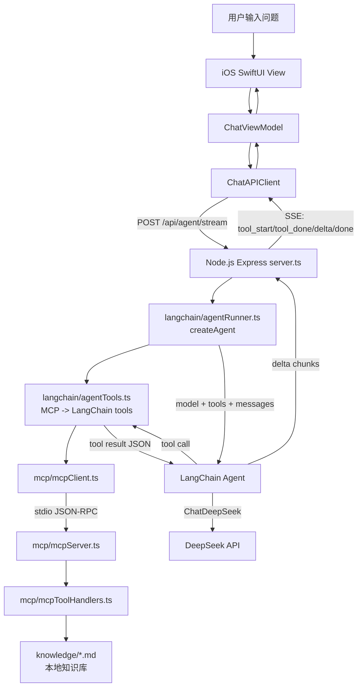

# AI iOS Chat Demo


一个用于学习的 AI 聊天 Demo，包含：

- `ios/ChatAI-iOS`：SwiftUI iOS App
- `backend-node`：Node.js + Express 后端

调用流程：

```text
iOS SwiftUI
  -> Node.js /api/agent/stream
  -> LangChain createAgent
  -> LangChain Tools
  -> MCP Client
  -> MCP Server / Tools
  -> ChatDeepSeek / DeepSeek API
  -> Node.js 通过 SSE 返回最终文本片段
  -> iOS 实时更新同一条 AI 消息气泡
```

项目里也保留了普通流式接口 `/api/chat/stream`
和非流式结构化接口 `/api/chat`，
方便后续继续做接口对比测试或“最终结构化卡片”升级。

## 1. 启动后端

先进入后端目录：

```bash
cd backend-node
```

复制环境变量示例文件：

```bash
cp .env.example .env
```

然后在 `.env` 里填入你的真实 `DEEPSEEK_API_KEY`。

安装依赖：

```bash
npm install
```

启动开发服务：

```bash
npm run dev
```

后端默认地址：

```text
http://127.0.0.1:8000
```

健康检查：

```bash
curl http://127.0.0.1:8000/health
```

## 2. 运行 iOS App

用 Xcode 打开：

```text
ios/ChatAI-iOS/ChatAI-iOS.xcodeproj
```

选择 iOS 模拟器运行即可。

iOS 端后端地址配置在：

```text
ios/ChatAI-iOS/ChatAI-iOS/Core/AppConfig.swift
```

模拟器调试时可以使用：

```text
http://127.0.0.1:8000
```

真机调试时需要改成 Mac 的局域网 IP，例如：

```text
http://192.168.1.23:8000
```

## 3. 注意事项

- 不要提交 `backend-node/.env`
- 不要提交 `backend-node/node_modules`
- 不要提交 Xcode 的 `xcuserdata`
- 可以提交 `backend-node/.env.example`，它只保存变量名，不保存真实密钥

## 4. RAG 知识库

知识库文档放在：

```text
backend-node/knowledge/
```

当前第二版 RAG 已经接入 LangChain：

```text
用户提问
  -> LangChain DirectoryLoader / TextLoader 读取 Markdown
  -> RecursiveCharacterTextSplitter 切 chunk
  -> LocalKeywordEmbeddings 生成本地学习版向量
  -> MemoryVectorStore 做相似度检索
  -> ChatPromptTemplate 组装 RAG prompt
  -> ChatDeepSeek 生成回答
  -> Node.js 通过 JSON 或 SSE 返回给 iOS
```

新增知识时，可以继续往 `backend-node/knowledge/` 里添加 `.md` 文件。

本地调试检索结果：

```bash
cd backend-node
npm run rag:debug -- "SwiftUI @State 和 @Binding 有什么区别"
```

这条命令不会调用 DeepSeek，只检查 LangChain 的 loader、splitter、embedding、vector store 和 retriever 是否命中正确资料。

当前默认 embedding provider 是 `local-keyword`。它不需要额外 API key，适合学习完整 RAG 链路。
后续如果要升级成真正语义 embedding，可以替换 `backend-node/src/langchain/embeddings.ts` 里的工厂函数。

RAG 相关环境变量：

```text
EMBEDDINGS_PROVIDER=local-keyword
RAG_TOP_K=5
RAG_CHUNK_SIZE=1200
RAG_CHUNK_OVERLAP=160
RAG_MIN_SIMILARITY=0.08
```

学习时可以先重点观察两个参数：

```text
RAG_TOP_K
  控制每次给模型多少段资料。太少可能漏资料，太多会增加 prompt 噪音。

RAG_CHUNK_SIZE / RAG_CHUNK_OVERLAP
  控制文档切分大小和相邻 chunk 的重叠范围。chunk 太大容易混入无关内容，太小容易丢上下文。
```

## 5. 后端代码结构

后端已经按职责拆成多个目录，`server.ts` 只保留 Express 路由和 HTTP/SSE 生命周期。

```text
backend-node/src/server.ts
  Express 路由、SSE 连接、服务启动

backend-node/src/config/env.ts
  读取和校验 .env 配置

backend-node/src/chat/chatCompletion.ts
  普通聊天接口的 LangChain RAG 上下文和 BaseMessage[] 组装

backend-node/src/chat/chatHistory.ts
  清洗 history，限制历史长度，组装检索 query

backend-node/src/chat/prompts.ts
  结构化输出、普通流式输出、Agent 的 prompt 规则

backend-node/src/chat/structuredAnswer.ts
  解析 /api/chat 的结构化 JSON 回答，并提供兜底解析

backend-node/src/knowledge/knowledge.ts
  知识库外观层，向上保留 retrieveRelevantKnowledge，底层调用 LangChain retriever

backend-node/src/langchain/documentLoader.ts
  使用 LangChain DirectoryLoader / TextLoader 读取 Markdown 知识库

backend-node/src/langchain/localEmbeddings.ts
  本地学习版 Embeddings，把中英文关键词 hash 成向量，方便无额外 key 跑通 RAG

backend-node/src/langchain/embeddings.ts
  Embeddings 工厂，后续替换真实 embedding provider 时优先改这里

backend-node/src/langchain/ragRetriever.ts
  LangChain TextSplitter + MemoryVectorStore + similarity search 主链路

backend-node/src/langchain/chatPrompt.ts
  使用 ChatPromptTemplate 组装普通 RAG 聊天 prompt

backend-node/src/langchain/chatModel.ts
  创建 LangChain ChatDeepSeek，并封装普通 invoke / stream 调用

backend-node/src/langchain/ragDebug.ts
  RAG 检索调试脚本，不启动后端也能查看命中的 chunk

backend-node/src/langchain/agentTools.ts
  把 MCP listTools() 返回的工具定义动态包装成 LangChain tools

backend-node/src/langchain/agentRunner.ts
  LangChain createAgent 主链路，负责工具决策、工具执行编排和最终流式输出

backend-node/src/langchain/agentDebug.ts
  Agent 本地调试脚本，不启动 iOS 也能观察 tool_start / tool_done / delta

backend-node/src/agent/agentRunner.ts
  兼容入口，向上 re-export LangChain Agent Runner，避免 server.ts 路径大改

backend-node/src/agent/agentTools.ts
  Agent SSE 工具事件辅助，把工具执行过程整理成 iOS 可展示的 tool_start / tool_done

backend-node/src/agent/agentToolTypes.ts
  Agent 内部工具结果类型和基础校验函数

backend-node/src/mcp/mcpServer.ts
  本地 MCP server，通过 stdio 暴露 searchKnowledge / generateQuiz 工具

backend-node/src/mcp/mcpClient.ts
  本地 MCP client，负责连接 MCP server、列工具、执行工具调用

backend-node/src/mcp/mcpToolHandlers.ts
  MCP 工具的真实业务实现

backend-node/src/http/sse.ts
  统一写 SSE event

backend-node/src/shared/types.ts
  后端共享类型
```

拆分后的职责关系：

```text
server.ts
  -> 普通聊天：chat/* -> knowledge/* -> langchain/* -> http/*
  -> Agent 聊天：agent/* -> langchain/* -> mcp/* -> knowledge/*
  -> 共用：config/* + shared/*
```

这样后续新增工具时，主要改 `src/mcp/mcpServer.ts` 和 `src/mcp/mcpToolHandlers.ts`；
调整 Agent 循环时，主要改 `src/langchain/agentRunner.ts`；
调整知识库检索时，优先改 `src/langchain/ragRetriever.ts`；
如果只是替换 embedding provider，优先改 `src/langchain/embeddings.ts`。

## 6. 多轮上下文

iOS 每次发送消息时，会把最近 6 条历史消息一起发送给后端：

```text
当前问题
  + 最近几条 user / assistant 历史
  -> Node.js
  -> AI API
```

这样用户继续追问：

```text
请更详细回答
继续
举个例子
```

AI 就能知道这些话是在接着上一轮问题说。

为了避免请求内容无限增长，当前只保留最近 6 条历史消息。

## 7. 流式输出

项目保留了普通流式输出接口：

```text
POST /api/chat/stream
```

它的目标是让用户不用等完整回答结束，而是可以看到 AI 一边生成、一边显示：

```text
iOS 发送 message + history
  -> Node.js 做 RAG 检索
  -> Node.js 请求 DeepSeek stream: true
  -> DeepSeek 返回一小段文本
  -> Node.js 通过 SSE 转发给 iOS
  -> iOS 追加到同一条 AI 气泡
```

### 为什么保留 /api/chat

项目里仍然保留原来的结构化接口：

```text
POST /api/chat
```

两个接口的区别是：

```text
/api/chat
  -> 等 AI 完整返回
  -> 后端解析结构化 JSON
  -> iOS 展示 title / summary / points / next_question 卡片

/api/chat/stream
  -> AI 边生成边返回
  -> 后端通过 SSE 推送 delta
  -> iOS 实时更新普通文本气泡
```

第一版流式输出先返回普通文本，不强制 JSON。

原因是结构化 JSON 不适合直接流式展示。否则用户会先看到类似下面的半截内容：

```text
{"title":"SwiftUI @State","summary":"...
```

这不是自然的聊天体验。

后续可以升级成：

```text
流式阶段：显示普通文本
结束阶段：再返回最终 structured answer
iOS：把普通文本气泡替换成结构化卡片
```

### SSE 返回格式

后端使用 Server-Sent Events，也就是：

```text
Content-Type: text/event-stream
```

每个事件都是一行 `data:`，后面跟 JSON：

```text
data: {"type":"tool_start","tool_call_id":"call_xxx","tool_name":"searchKnowledge","display_name":"查询知识库","message":"正在查询知识库"}

data: {"type":"tool_done","tool_call_id":"call_xxx","tool_name":"searchKnowledge","display_name":"查询知识库","ok":true,"message":"已查询知识库，找到 2 条相关资料"}

data: {"type":"delta","delta":"SwiftUI "}

data: {"type":"delta","delta":"里的 @State "}

data: {"type":"delta","delta":"用于保存当前 View 的状态。"}

data: {"type":"done"}
```

如果流式过程中出错，后端会发送：

```text
data: {"type":"error","error":"Failed to stream AI response."}
```

iOS 只需要解析这几种事件：

```text
tool_start：显示 Agent 正在调用哪个工具
tool_done：显示工具执行结果摘要
delta：追加文本
done：结束本次回答
error：显示错误提示
```

### iOS 更新方式

流式输出时，iOS 不会等完整答案回来再追加 AI 消息。

它会先创建一条空的 assistant 消息：

```text
用户消息
AI 空消息
```

然后每收到一个 `delta`，就更新同一条 AI 消息的 `content`：

```text
AI 空消息
AI: SwiftUI
AI: SwiftUI 里的 @State
AI: SwiftUI 里的 @State 用于保存当前 View 的状态。
```

关键点是：这条 AI 消息的 `id` 必须保持不变。

如果每个 delta 都创建一个新 id，SwiftUI 会认为它们是很多条不同消息，列表滚动和动画都会不稳定。

### 和上下文记忆的关系

流式输出后，AI 回复是普通文本，不一定有 `structuredAnswer`。

所以整理 history 时不能只保存结构化回答，也要保存普通 assistant 文本。

当前逻辑会：

```text
排除第一条欢迎语
保留后续真实 user / assistant 消息
只取最近 6 条
发送给后端
```

这样用户继续追问：

```text
继续
举个例子
好，讲这个
```

AI 仍然能看到上一轮流式生成的回答内容。

### 手动测试流式接口

启动后端后，可以用 curl 测试：

```bash
curl -N \
  -X POST http://127.0.0.1:8000/api/chat/stream \
  -H "Content-Type: application/json" \
  -d '{
    "message": "SwiftUI 的 @State 是什么？",
    "system_prompt": "You are a friendly iOS tutor.",
    "history": []
  }'
```

`-N` 的作用是关闭 curl 的输出缓冲。

如果不加 `-N`，curl 可能会等攒够一批内容后再显示，看起来就不像实时流式输出。

## 8. LangChain Tool / Agent / MCP

当前 App 默认使用第二阶段 LangChain Agent 流式接口：

```text
POST /api/agent/stream
```

它把工具决策、工具执行编排和最终回答流式输出交给 LangChain createAgent：

```text
iOS 发送 message + history
  -> Node.js 通过 MCP client 从 MCP server 获取可用工具
  -> langchain/agentTools.ts 把 MCP tools 包装成 LangChain tools
  -> langchain/agentRunner.ts 创建 LangChain Agent
  -> Agent 判断是否需要调用工具
  -> Tool wrapper 通过 SSE 发送 tool_start
  -> Tool wrapper 通过 MCP client 调用 MCP server
  -> MCP server 校验参数并执行真正的工具
  -> Tool wrapper 通过 SSE 发送 tool_done
  -> LangChain 把工具结果作为 ToolMessage 交回 Agent
  -> Agent 基于工具结果生成最终回答
  -> Node.js 通过 SSE 流式返回给 iOS
```

整体调用链路可以看成下面这张图：



### Tool Calling 是什么

Tool Calling 不是模型真的执行代码。

模型只会返回类似下面的结构化请求：

```json
{
  "name": "searchKnowledge",
  "arguments": {
    "query": "SwiftUI @State"
  }
}
```

真正执行工具的是 Node.js 后端里的 MCP server。

这样做的好处是：

```text
模型负责理解用户意图、选择工具、组织回答
MCP server 负责校验参数、执行工具、控制权限和安全边界
```

### MCP 是什么

MCP 可以理解成 AI Agent 调用外部能力的标准协议。

它把 AI 应用拆成两侧：

```text
MCP Client
  发起 listTools / callTool / readResource 等标准请求

MCP Server
  暴露 tools / resources / prompts，并执行真实能力
```

在这个项目里：

```text
langchain/agentRunner
  -> langchain/agentTools
  -> mcpClient
  -> mcpServer
  -> mcpToolHandlers
```

也就是说，LangChain Agent 负责“怎么决定和编排工具”，
MCP server 负责“工具定义、参数校验和真实执行”。

### 当前支持的工具

当前 Agent 开放两个低风险学习工具：

```text
searchKnowledge(query)
  搜索 backend-node/knowledge/ 里的 Markdown 知识库

generateQuiz(topic, count)
  根据学习主题生成 1 到 5 道练习题
```

这两个工具现在由 `backend-node/src/mcp/mcpServer.ts` 通过 MCP 暴露。
它们都不会修改数据，也不会调用外部业务系统，适合先把 Tool Calling + MCP 主流程跑通。

### LangChain Agent 循环

后端现在使用 LangChain createAgent 管理循环。

它的工作方式是：

```text
最多执行 2 次工具调用

Agent 收到用户问题
  -> 模型判断是否需要工具
  -> 如果需要：LangChain 调用对应 tool wrapper
  -> tool wrapper 通过 MCP 执行真实工具
  -> LangChain 把工具结果放回 Agent 上下文
  -> Agent 继续判断或生成最终回答

如果不需要工具：
  -> Agent 直接生成最终回答
```

为什么还要限制工具次数？

因为模型有可能反复调用工具。比如一直搜索知识库、一直换 query。
`toolCallLimitMiddleware` 可以避免一次请求无限执行工具。

### 为什么最终回答仍然流式返回

LangChain Agent 支持把最终回答作为 message text stream 读出来。
后端把这些文本片段转成现有 iOS 能识别的 SSE delta：

```text
LangChain message.text
  -> server.ts onDelta
  -> SSE delta
  -> iOS 追加到当前 AI 气泡
```

### iOS 如何展示 Agent 执行过程

Agent 接口会在工具开始和结束时发送额外 SSE 事件：

```text
tool_start
  -> iOS 在当前 AI 气泡里显示“正在查询知识库”

tool_done
  -> iOS 把同一步更新成“已查询知识库，找到 2 条相关资料”

delta
  -> iOS 继续把最终回答追加到同一条 AI 气泡
```

这样聊天列表仍然保持：

```text
用户一条消息
AI 一条消息
```

但 AI 消息内部能看到 Agent 调用了哪个工具。

### 手动测试 Agent 接口

不启动后端时，可以直接跑本地 Agent 调试脚本：

```bash
cd backend-node
npm run agent:debug -- "SwiftUI @State 和 @Binding 有什么区别？请先查知识库再回答。"
```

如果终端里看到 `tool_start` / `tool_done`，说明 LangChain Agent 已经成功调用 MCP 工具。

也可以单独启动 MCP server 做协议调试：

```bash
npm run mcp:dev
```

正常后端开发不需要手动启动它。
`/api/agent/stream` 会通过 `src/mcp/mcpClient.ts` 自动拉起本地 stdio MCP server。

启动后端后，可以测试知识库工具：

```bash
curl -N \
  -X POST http://127.0.0.1:8000/api/agent/stream \
  -H "Content-Type: application/json" \
  -d '{
    "message": "SwiftUI 的 @State 是什么？请先查知识库再回答。",
    "system_prompt": "You are a friendly iOS tutor.",
    "history": []
  }'
```

也可以测试练习题工具：

```bash
curl -N \
  -X POST http://127.0.0.1:8000/api/agent/stream \
  -H "Content-Type: application/json" \
  -d '{
    "message": "基于 SwiftUI @Binding 给我出 3 道练习题。",
    "system_prompt": "You are a friendly iOS tutor.",
    "history": []
  }'
```

如果后端日志里看到类似：

```text
[Agent] {"phase":"tool_setup","event":"langchain_tools_loaded",...}
[Agent] {"phase":"langchain_agent","event":"completed",...}
```

说明模型已经触发 Tool Calling，后端也通过 MCP 执行了对应工具。
