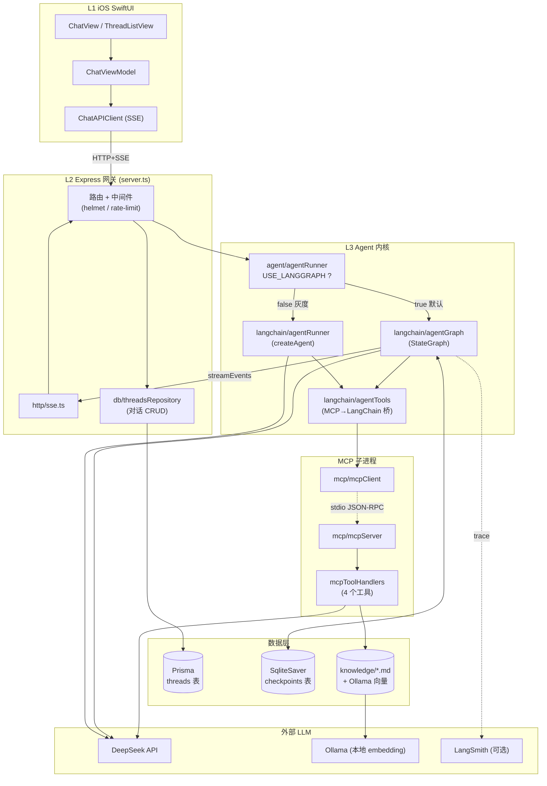
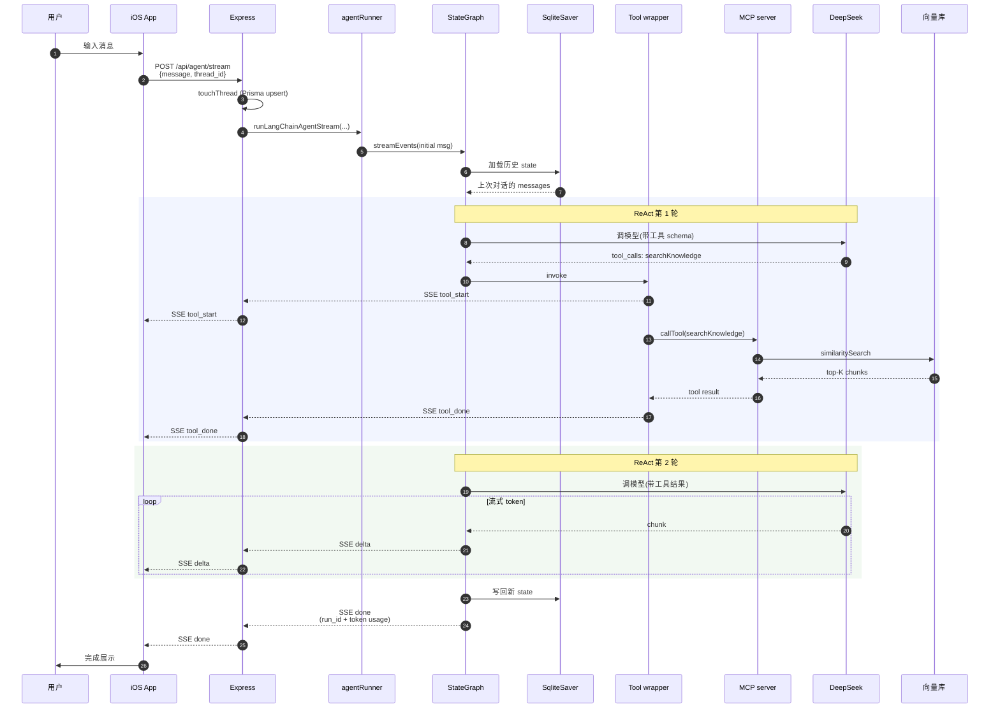
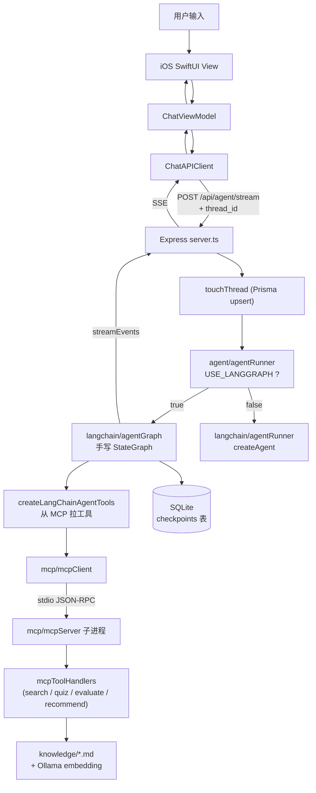
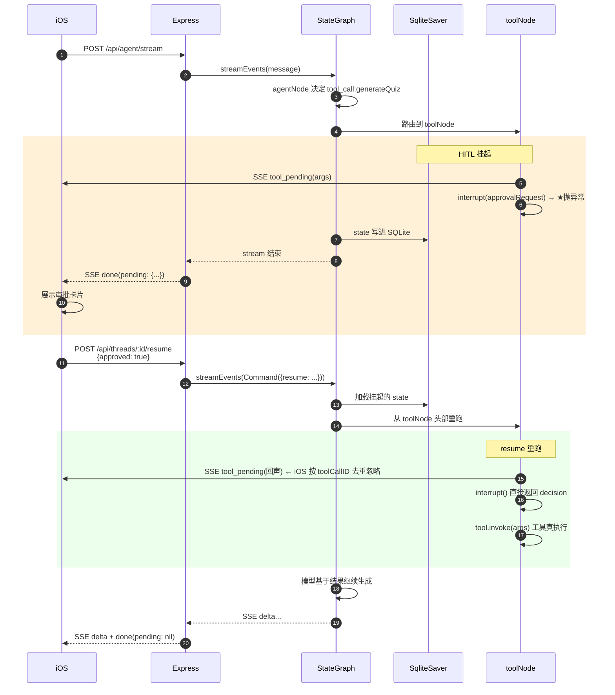
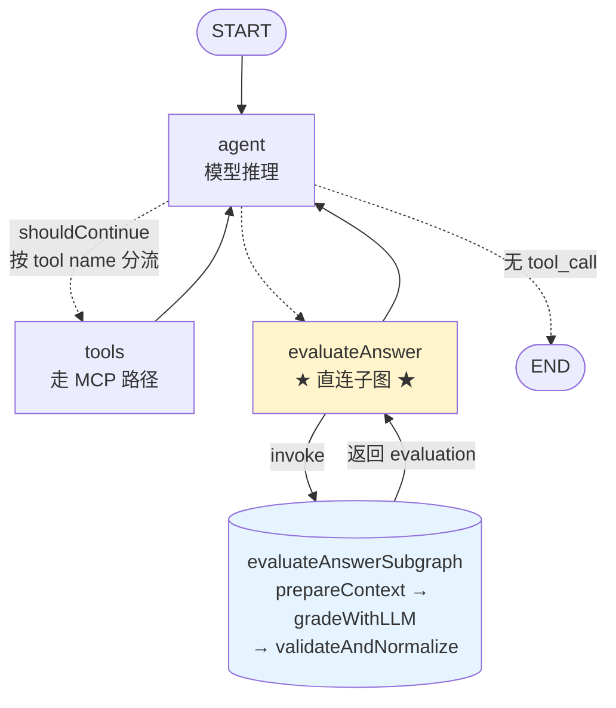
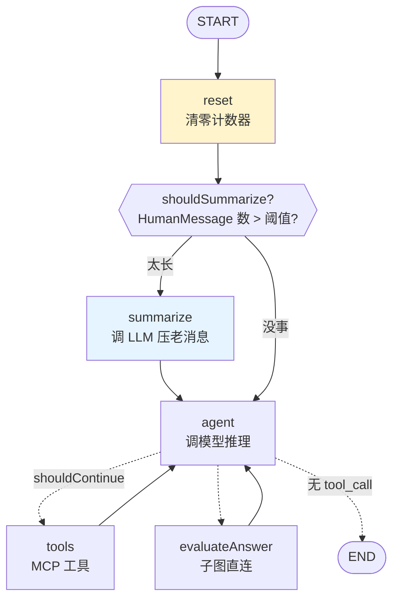
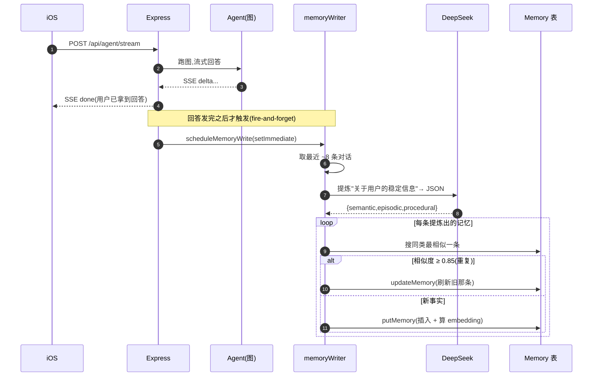

# AI iOS Chat Demo


一个用于学习的 AI 聊天 Demo，从最朴素的"模型直答"一路演进到"带工具、带 RAG、带持久化、带 LangGraph 状态机"的完整 Agent 系统。

- `ios/ChatAI-iOS`：SwiftUI iOS App（带对话列表、流式气泡、工具进度展示）
- `backend-node`：Node.js + Express + LangChain + LangGraph + MCP 后端

当前默认调用流程：

```text
iOS SwiftUI（对话列表 + 聊天页）
  -> POST /api/agent/stream (带 thread_id)
  -> Node.js Express 路由
  -> Phase 4 LangGraph StateGraph（或 Phase 3 createAgent，灰度切换）
  -> agentNode → toolNode → agentNode（ReAct 循环）
  -> LangChain Tools（从 MCP 动态加载）
  -> MCP Client → MCP Server 子进程（stdio JSON-RPC）
  -> 真实工具（searchKnowledge / generateQuiz / evaluateAnswer / recommendNextTopic）
  -> ChatDeepSeek
  -> SqliteCheckpointer 自动存档 state
  -> Node.js 通过 SSE 返回工具事件 + 最终文本片段
  -> iOS 实时更新同一条 AI 消息气泡
```

项目里也保留了：

- `/api/chat/stream`：普通流式接口（固定 RAG，无工具，对比用）
- `/api/chat`：非流式结构化 JSON 接口（最早期版本）

方便对比不同阶段的实现差异。

---

## 0. 体系总览（看这一节就懂整个系统）

### 0.1 三层心智模型

把整个项目折叠成三层来理解,后面所有细节都是这三层的展开:

```text
┌────────────────────────────────────────────────────────────┐
│  L1  客户端 (iOS SwiftUI)                                  │
│      负责:  UI / 流式气泡 / 对话列表 / 工具进度展示         │
│      不负责: 对话历史(交给后端 thread_id 管)               │
└──────────────────────────┬─────────────────────────────────┘
                           │  HTTP + SSE
┌──────────────────────────▼─────────────────────────────────┐
│  L2  网关 (Node.js + Express)                              │
│      负责:  路由 / 鉴权 / Rate Limit / SSE 协议 / 持久化   │
│      入口:  /api/agent/stream (主)  /api/chat[/stream]     │
└──────────────────────────┬─────────────────────────────────┘
                           │  函数调用
┌──────────────────────────▼─────────────────────────────────┐
│  L3  Agent 内核 (LangChain + LangGraph + MCP)             │
│      负责:  ReAct 循环 / 工具调用 / RAG / 状态持久化       │
│      实现:  StateGraph(默认) 或 createAgent(灰度回退)      │
└────────────────────────────────────────────────────────────┘
```

### 0.2 模块依赖全景图



读图技巧:实线 = 调用,虚线 = 协议/可选;桶状图 = 数据存储;每个 subgraph 对应一个目录或职责块。

### 0.3 一次请求的完整时序

这是用户在 iOS 输入"SwiftUI @State 是什么?请先查知识库"后,系统内部发生的事情:



### 0.4 核心概念速查表

| 概念 | 一句话 | 在哪看 |
|---|---|---|
| **ReAct** | "Reason→Act→Observe→Reason" 循环,模型决定调工具,框架执行,把结果丢回模型 | `agentGraph.ts` 的图形 |
| **StateGraph** | LangGraph 的图编程模型:节点(函数) + 边(条件路由) + 共享 state | `agentGraphState/Nodes/Graph.ts` |
| **Checkpointer** | 自动把 state 按 thread_id 存进 SQLite,跨请求恢复对话 | `db/sqliteCheckpointer.ts` |
| **MCP** | "工具协议":Client 调 `listTools` / `callTool`,Server 暴露工具 | `mcp/` 整个目录 |
| **Tool Calling** | 模型不真执行代码,只返回 `{name, arguments}`,框架负责调 | `agentTools.ts` 的 wrapper |
| **RAG** | 检索 → 拼 context → 让模型基于资料回答(防胡说) | `ragRetriever.ts` |
| **SSE** | "Server-Sent Events":单向流式 HTTP,token 一边产一边推 | `http/sse.ts` |
| **Embedding** | 把文本变成向量,余弦相似度近 = 语义近 | `embeddings.ts` (Ollama) |
| **LangSmith** | 可观测平台,自动 trace 每一步 + 收用户反馈 | `langsmithClient.ts` |
| **Eval** | 离线给 Agent 出 21 道题,4 个评分器打分,改完跑一遍看分数 | `evals/` 目录 |
| **HITL** (Phase 9) | Human-in-the-Loop:`interrupt()` 让图暂停,等用户在 iOS 上批准再执行工具 | §11 章节 |
| **Subgraph** (Phase 9) | 把复杂工具的内部流程拆成"图中图",主图把子图当普通节点用 | §12 章节 |
| **Time-travel** (Phase 9) | 从历史 checkpoint 分叉出新 thread,像 git checkout 一样回到过去 | §13 章节 |
| **Summarization** (Phase 11) | 长对话时让 LLM 把老消息压成 summary,`RemoveMessage` 把原文删掉,token 成本从线性增长变有上限 | §14 章节 |
| **Long-term Memory** (Phase 12) | 跨对话记忆:对话结束 LLM 提炼用户事实/偏好存进向量库,新对话按语义召回注入 prompt——checkpointer 解决"thread 内",这解决"thread 间" | §15 章节 |

### 0.5 三个核心权衡

学习这个项目时最值得品的三个设计取舍:

```text
1. Phase 3 createAgent  vs  Phase 4 手写 StateGraph
   - createAgent 帮你藏起 ReAct 循环,代码少但你看不见图
   - 手写 StateGraph 你能画出每一步,但要自己管 state、边、终止条件
   - 项目并存两条路径,USE_LANGGRAPH 灰度切换,既能学又能对比

2. 有 thread_id  vs  无 thread_id
   - 有: 后端 checkpointer 管历史,iOS 一行 history 都不用带
   - 无: iOS 每次带 history,后端无状态(老接口兼容)
   - 同一个 endpoint 两种模式,看 thread_id 自动切换

3. MCP 工具  vs  直接写在 Agent 里
   - MCP 多一层(stdio 子进程 + JSON-RPC),但工具协议解耦
   - 工具内部要换实现 / 部署成独立服务,Agent 代码不用动
   - 这是为"以后接外部 MCP server 生态"留的口子
```

---

## Phase 演进历史

这个项目是按 Phase 渐进推进的，每个 Phase 都是一个完整的学习阶段：

| Phase | 主要内容 | 关键文件 |
|-------|---------|---------|
| Phase 1 | 最基础的 OpenAI 兼容直答 | `chat/*` |
| Phase 2 | 接入 LangChain + RAG 知识库 | `langchain/ragRetriever.ts` |
| Phase 3 | LangChain `createAgent` + MCP 工具 | `langchain/agentRunner.ts` |
| Phase 4 | 手写 LangGraph StateGraph（替代 createAgent） | `langchain/agentGraph*.ts` |
| Phase 5 | Prisma + SqliteCheckpointer 持久化对话 | `db/*` |
| Phase 5.6 | iOS 对话列表 UI | `Views/ThreadListView.swift` |
| Phase 6 | Ollama 真实 Embedding + 向量缓存 | `langchain/embeddings.ts` `langchain/ragCache.ts` |
| Phase 7 | 工具集扩展到 4 个（LLM-as-judge + 学习规划） | `mcp/mcpToolHandlers.ts` |
| Phase 10 | 生产化：LangSmith trace + Eval + CI/CD + 安全加固 + Docker | `langsmithClient.ts` `evals/` `Dockerfile` |
| **Phase 9** | **高级 LangGraph:HITL 人工审核 + Subgraph 子图 + Time-travel 时光机** | `agentGraphNodes.ts` `subgraphs/evaluateAnswerGraph.ts` `ToolApprovalCard.swift` |
| **Phase 11** | **对话压缩 + 顺手修了一个 per-request 计数器老 bug**(为 Phase 8 Multi-Agent 铺路) | `summarizeNode.ts` `agentGraphState.ts`(summary channel) `ChatView.swift`(chip) |
| **Phase 12** | **跨对话长期记忆:User/Memory 表 + 自动提炼写入 + 语义召回注入 + iOS 记忆管理页** | `memory/memoryStore.ts` `memory/memoryWriter.ts` `agentGraphNodes.ts`(recall 节点) `MemoryListView.swift` |

Phase 3 和 Phase 4 通过 `USE_LANGGRAPH` 环境变量灰度切换,行为完全等价。
**注意 Phase 9 / Phase 11 都只在 USE_LANGGRAPH=true 路径生效**——
createAgent 路径不接 checkpointer,而 HITL / Subgraph / Time-travel / Summarization
这几块全部依赖 checkpointer 持久化 state。

---

## 1. 启动后端

### 1.1 基础步骤

```bash
cd backend-node
cp .env.example .env
```

在 `.env` 里至少填入真实的 `DEEPSEEK_API_KEY`。

```bash
npm install
```

### 1.2 初始化数据库（Phase 5 新增）

Phase 5 引入了 Prisma + SQLite 持久化对话。首次启动前必须跑 migration：

```bash
npx prisma migrate dev
```

这一步会做三件事：

```text
1. 在 backend-node/prisma/ 下创建 dev.db SQLite 文件
2. 应用 migrations/ 里的所有 SQL（建 threads 表）
3. 生成 @prisma/client TypeScript 客户端
```

LangGraph 的 `SqliteCheckpointer` 会使用同一个 `dev.db` 文件，
但 `checkpoints` / `writes` / `checkpoint_blobs` 这些表是它运行时自动建的，
Prisma 不管它们。

### 1.3 安装 Ollama 跑真实 embedding(默认必装)

当前默认 `EMBEDDINGS_PROVIDER=ollama`,所以**首次启动前必须装好 Ollama 并拉模型**,
否则第一次 Agent 请求会因为连不上 Ollama 报错。

```bash
# macOS
brew install ollama
ollama serve &
ollama pull nomic-embed-text   # 默认模型,274 MB,768 维多语言
```

`.env` 里相关配置(`.env.example` 已写好默认值):

```text
EMBEDDINGS_PROVIDER=ollama
OLLAMA_BASE_URL=http://127.0.0.1:11434
OLLAMA_EMBEDDING_MODEL=nomic-embed-text
```

如果不想装 Ollama(纯离线 / CI 环境),可以退回到零依赖的关键词假向量:

```text
EMBEDDINGS_PROVIDER=local-keyword
```

切换后第一次 Agent 请求会触发向量构建（约 30-50 个 chunk × 几十毫秒），
之后会被 `.rag-cache/vectors.json` 缓存下来，重启进程后秒级加载。

### 1.4 启动开发服务

```bash
npm run dev
```

后端默认地址：

```text
http://127.0.0.1:8000
```

健康检查：

```bash
curl http://127.0.0.1:8000/health
```

启动后控制台会打印一行 LangSmith 状态：

```text
[LangSmith] tracing disabled (set LANGSMITH_TRACING=true to enable)
```

接入 LangSmith 是 Phase 10 的事，详见 `.env.example` 里的注释。

---

## 2. 运行 iOS App

用 Xcode 打开：

```text
ios/ChatAI-iOS/ChatAI-iOS.xcodeproj
```

选择 iOS 模拟器运行即可。

iOS 端后端地址配置在：

```text
ios/ChatAI-iOS/ChatAI-iOS/Core/AppConfig.swift
```

模拟器调试时可以使用：

```text
http://127.0.0.1:8000
```

真机调试时需要改成 Mac 的局域网 IP，例如：

```text
http://192.168.1.23:8000
```

### Phase 5.6 后的 iOS 主要界面

```text
ThreadListView（对话列表）
  -> 显示所有历史对话（按最近活跃倒序）
  -> 滑动可删除
  -> 点击进入 ChatView
  -> 顶部"新建"按钮可开始新对话

ChatView（聊天页）
  -> 流式气泡
  -> 工具进度（"正在查询知识库..." → "已查询知识库，找到 N 条相关资料"）
  -> 切换对话后自动从后端拉历史
```

---

## 3. 注意事项

- 不要提交 `backend-node/.env`
- 不要提交 `backend-node/node_modules`
- 不要提交 `backend-node/prisma/dev.db`（已在 `.gitignore`）
- 不要提交 `backend-node/.rag-cache/`（已在 `.gitignore`）
- 不要提交 Xcode 的 `xcuserdata`
- 可以提交 `backend-node/.env.example`
- 必须提交 `backend-node/prisma/migrations/`（别人 clone 后才能重建数据库）

---

## 4. RAG 知识库

知识库文档放在：

```text
backend-node/knowledge/
```

当前 RAG 已经接入 LangChain：

```text
用户提问
  -> LangChain DirectoryLoader / TextLoader 读取 Markdown
  -> RecursiveCharacterTextSplitter（markdown 模式）切 chunk
  -> Embeddings 生成向量（local-keyword 或 Ollama）
  -> MemoryVectorStore 做相似度检索
  -> 命中的 chunk 作为工具结果交回 Agent
  -> ChatDeepSeek 基于结果生成回答
  -> Node.js 通过 SSE 返回给 iOS
```

新增知识时，往 `backend-node/knowledge/` 里添加 `.md` 文件即可。

### 4.1 本地调试检索结果

```bash
cd backend-node
npm run rag:debug -- "SwiftUI @State 和 @Binding 有什么区别"
```

这条命令不会调用 DeepSeek，只检查 LangChain 的 loader、splitter、embedding、vector store 和 retriever 是否命中正确资料。

### 4.2 Embedding Provider 切换

```text
EMBEDDINGS_PROVIDER=ollama            # 默认，真实语义向量，需要本地 Ollama
EMBEDDINGS_PROVIDER=local-keyword     # 零依赖兜底，关键词 hash 成伪向量
```

切换 provider 后，向量缓存会自动失效重建（缓存指纹包含 embedding 标识）。
详见 `backend-node/src/langchain/ragCache.ts`。

### 4.3 RAG 调参

```text
RAG_TOP_K=5            每次给模型多少段资料
RAG_CHUNK_SIZE=1200    切分大小
RAG_CHUNK_OVERLAP=160  相邻 chunk 的重叠范围
RAG_MIN_SIMILARITY=0.08  分数下限，太低的不送进模型
```

---

## 5. 后端代码结构

### 5.0 按职责分组速览

```text
backend-node/src/
├── server.ts                    ★ 唯一入口:路由 + 中间件 + SSE
├── config/    env.ts            统一读取 .env
├── shared/    types.ts          全局共享类型(SSE 事件、HTTP body 等)
│
├── 【入口路由路径】
│   ├── chat/                    普通聊天(/api/chat 和 /api/chat/stream)
│   │   ├── chatCompletion.ts    组装 RAG context + history → BaseMessage[]
│   │   ├── chatHistory.ts       清洗 iOS 历史 + 构造 RAG query
│   │   ├── prompts.ts           所有 system prompt 在这里拼装
│   │   └── structuredAnswer.ts  解析 /api/chat 的 JSON 输出
│   │
│   └── agent/                   Agent 入口 + 共用层
│       ├── agentRunner.ts       ★ 灰度路由:Phase 3 / Phase 4 切换
│       ├── agentObservability.ts  按 requestId 的结构化日志
│       ├── agentTools.ts        tool_start/done SSE 事件 builder
│       └── agentToolTypes.ts    项目内部工具结果统一类型
│
├── 【Agent 实现路径】(LangChain / LangGraph)
│   └── langchain/
│       ├── chatModel.ts         ChatDeepSeek 实例工厂(项目唯一出口)
│       ├── chatPrompt.ts        ChatPromptTemplate + content 工具
│       │
│       ├── agentRunner.ts       Phase 3: createAgent + middleware
│       ├── agentTools.ts        MCP → LangChain Tool 桥
│       │
│       ├── agentGraph.ts        Phase 4: 手写 StateGraph 主链路
│       ├── agentGraphState.ts   State schema (Annotation.Root)
│       ├── agentGraphNodes.ts   agentNode / toolNode / shouldContinue
│       │
│       ├── ragRetriever.ts      向量检索主入口
│       ├── ragCache.ts          向量磁盘缓存(指纹失效)
│       ├── documentLoader.ts    Markdown → LangChain Document
│       ├── embeddings.ts        Embeddings 工厂(Ollama / 兜底)
│       ├── localEmbeddings.ts   零依赖伪向量
│       │
│       ├── langsmithClient.ts   LangSmith feedback 入口
│       ├── agentDebug.ts        Agent 本地调试脚本
│       └── ragDebug.ts          RAG 本地调试脚本
│
├── 【工具协议层】(MCP)
│   └── mcp/
│       ├── mcpClient.ts         工具调用方(单例 + 自动重连)
│       ├── mcpServer.ts         工具提供方(stdio 子进程)
│       ├── mcpToolHandlers.ts   4 个工具真实实现
│       ├── generateQuizDebug.ts
│       ├── evaluateAnswerDebug.ts
│       └── recommendNextTopicDebug.ts
│
├── 【数据 / 协议 / 知识库】
│   ├── db/
│   │   ├── prisma.ts            Prisma Client 单例
│   │   ├── sqliteCheckpointer.ts  LangGraph SqliteSaver 单例
│   │   ├── threadsRepository.ts 对话 CRUD(跨 Prisma + checkpointer)
│   │   └── prismaDebug.ts
│   ├── http/   sse.ts           SSE 写出器(一个函数)
│   └── knowledge/ knowledge.ts  知识库外观层(facade)
│
└── 【生产化配套】
    ├── ../Dockerfile            多阶段构建
    ├── ../.dockerignore
    ├── ../prisma/schema.prisma  threads 表 schema
    ├── ../evals/                离线评测体系
    └── ../../.github/workflows/ci.yml
```

### 5.1 文件用途详表

```text
backend-node/src/server.ts
  Express 路由、SSE 连接、服务启动、对话 CRUD 接口

backend-node/src/config/env.ts
  读取和校验 .env 配置

# Chat 模块（普通聊天）
backend-node/src/chat/chatCompletion.ts
  普通聊天接口的 LangChain RAG 上下文组装
backend-node/src/chat/chatHistory.ts
  清洗 history，限制历史长度
backend-node/src/chat/prompts.ts
  结构化输出、普通流式输出、Agent 的 prompt 规则（Phase 7 重构）
backend-node/src/chat/structuredAnswer.ts
  解析 /api/chat 的结构化 JSON 回答

# Knowledge / RAG 模块
backend-node/src/knowledge/knowledge.ts
  知识库外观层
backend-node/src/langchain/documentLoader.ts
  使用 DirectoryLoader / TextLoader 读取 Markdown
backend-node/src/langchain/embeddings.ts
  Embeddings 工厂（local-keyword / Ollama 切换）
backend-node/src/langchain/localEmbeddings.ts
  本地学习版关键词向量
backend-node/src/langchain/ragRetriever.ts
  TextSplitter + MemoryVectorStore + similarity search 主链路
backend-node/src/langchain/ragCache.ts
  Phase 6.4 向量缓存（指纹 + JSON 持久化）
backend-node/src/langchain/ragDebug.ts
  RAG 调试脚本

# Chat Model 封装
backend-node/src/langchain/chatModel.ts
  创建 LangChain ChatDeepSeek，封装 invoke / stream
backend-node/src/langchain/chatPrompt.ts
  ChatPromptTemplate 工具函数

# Agent 路由层（Phase 4 灰度入口）
backend-node/src/agent/agentRunner.ts
  根据 USE_LANGGRAPH 切换 Phase 3 / Phase 4 实现
backend-node/src/agent/agentTools.ts
  Agent SSE 工具事件辅助（tool_start / tool_done 文案）
backend-node/src/agent/agentToolTypes.ts
  Agent 工具结果类型 + 校验函数
backend-node/src/agent/agentObservability.ts
  结构化日志（按 requestId trace 整条链路）

# Phase 3 路径（LangChain createAgent）
backend-node/src/langchain/agentRunner.ts
  createAgent + middleware（retry / callLimit / toolCallLimit）
backend-node/src/langchain/agentTools.ts
  MCP tools → LangChain tools 桥接
backend-node/src/langchain/agentDebug.ts
  Agent 本地调试脚本

# Phase 4 路径（手写 LangGraph StateGraph）
backend-node/src/langchain/agentGraphState.ts
  State schema（messages + modelCallCount + toolCallCount）
backend-node/src/langchain/agentGraphNodes.ts
  agentNode、toolNode、shouldContinue 条件边
backend-node/src/langchain/agentGraph.ts
  组装 StateGraph、挂 checkpointer、streamEvents

# MCP（工具协议层）
backend-node/src/mcp/mcpServer.ts
  本地 MCP server，通过 stdio 暴露 4 个工具
backend-node/src/mcp/mcpClient.ts
  本地 MCP client，启动子进程 + listTools + callTool
backend-node/src/mcp/mcpToolHandlers.ts
  4 个工具的真实业务实现
backend-node/src/mcp/generateQuizDebug.ts
backend-node/src/mcp/evaluateAnswerDebug.ts
backend-node/src/mcp/recommendNextTopicDebug.ts
  工具独立调试脚本

# Phase 5 持久化
backend-node/prisma/schema.prisma
  Prisma 数据库设计图（threads 表）
backend-node/src/db/prisma.ts
  Prisma client 单例
backend-node/src/db/sqliteCheckpointer.ts
  LangGraph SqliteSaver 单例工厂
backend-node/src/db/threadsRepository.ts
  对话 CRUD 业务封装（跨 Prisma + checkpointer 两层）
backend-node/src/db/prismaDebug.ts
  Prisma 调试脚本

# Phase 10 LangSmith + Eval
backend-node/src/langchain/langsmithClient.ts
  LangSmith Client 单例 + submitUserFeedback()
backend-node/evals/
  自动评测体系（详见 evals/README.md）
  evals/datasets/qa.jsonl        21 条评测用例（7 场景 × 3 条）
  evals/lib/types.ts             核心类型（EvalCase / EvalResult / Evaluator）
  evals/lib/dataset.ts           数据集加载器（jsonl → EvalCase[]）
  evals/lib/runAgent.ts          Agent 纯函数包装（绕过 HTTP 直接调）
  evals/evaluators/              4 个评分器（toolChoice / keyword / toolChain / llmJudge）
  evals/runEval.ts               主入口（读数据集 → 跑 Agent → 评分 → 出报告）

# Phase 10.4 生产化
backend-node/Dockerfile
  多阶段构建（builder 编译 + runner 只跑 JS）
backend-node/.dockerignore
  Docker 构建时忽略的文件
docker-compose.yml
  编排配置（端口 / 环境变量 / 数据卷 / 重启策略）
.github/workflows/ci.yml
  GitHub Actions CI（tsc 检查 + eval 快速检查 + PR 自动评论）

# 通用
backend-node/src/http/sse.ts
  统一写 SSE event
backend-node/src/shared/types.ts
  后端共享类型（含 SSE 事件 token 用量字段）
```

拆分后的职责关系：

```text
server.ts
  -> 普通聊天：chat/* -> knowledge/* -> langchain/* -> http/*
  -> Agent 聊天：agent/agentRunner（灰度）
                  ├── Phase 3: langchain/agentRunner（createAgent）
                  └── Phase 4: langchain/agentGraph*（手写 StateGraph）
                                  └── db/sqliteCheckpointer（持久化）
  -> 工具：agent/* -> mcp/* -> 真实工具实现
  -> 对话管理：db/threadsRepository -> prisma + checkpointer 双源
  -> 共用：config/* + shared/*
```

---

## 6. 多轮上下文与持久化（Phase 5）

### 6.1 持久化模式（当前默认）

```text
iOS 第一次发消息时：
  POST /api/threads → 后端建一行 threads 记录 → 返回 thread.id

iOS 后续每次发消息：
  POST /api/agent/stream { message, thread_id }
  history 字段固定传空数组

后端拿到 thread_id：
  touchThread(threadId)            ← upsert + 刷新 updatedAt
  graph.streamEvents(...,
    { configurable: { thread_id }})
  ↑ 关键：LangGraph 用 SqliteSaver 自动从 checkpoint 加载历史 state，
    跑完图后又把新 state 写回 checkpoint
```

iOS 端 history 不再带，整段对话历史**完全由后端 checkpointer 管理**。这样：

- 用户切换设备能接上（id 在云端）
- 关闭 App 重开能接上
- 单条请求的 payload 永远很小

### 6.2 无持久化模式（兼容老接口）

如果不传 `thread_id`，后端走 Phase 4 老行为：

```text
state 是临时的（每次请求白板从空开始）
iOS 必须自己带 history
图跑完 state 立刻丢弃
```

主要给：
- 老版本 iOS 兼容
- 不需要"对话连续性"的一次性问答
- 自动化测试

### 6.3 对话 CRUD 接口

```text
POST   /api/threads               新建对话（body 可选 title）
GET    /api/threads               列出所有对话（按 updatedAt 倒序）
GET    /api/threads/:id/messages  拉某对话的可展示消息（过滤内部消息）
DELETE /api/threads/:id           删除对话（同时清掉 checkpointer state）
```

返回 `messages` 时已经过滤掉了 Agent 内部消息（tool_calls 中间消息、ToolMessage），
iOS 只看到 user / assistant 的真实对话。

详见 `backend-node/src/db/threadsRepository.ts`。

---

## 7. 流式输出

### 7.1 三个接口对比

```text
POST /api/chat
  -> 等 AI 完整返回
  -> 后端解析结构化 JSON（title/summary/points/next_question）
  -> iOS 展示卡片

POST /api/chat/stream
  -> 固定 RAG（不走 Agent）
  -> AI 边生成边返回
  -> 后端通过 SSE 推送 delta
  -> iOS 实时更新普通文本气泡

POST /api/agent/stream     ★ 当前 iOS 默认入口
  -> Agent 决定是否调工具（最多 N 轮 ReAct 循环）
  -> SSE 推送 tool_start / tool_done / delta / done
  -> iOS 显示工具进度 + 流式回答
  -> 带 thread_id 时自动持久化
```

### 7.2 SSE 事件格式

每行 `data:` 后面跟 JSON：

```text
data: {"type":"tool_start","tool_call_id":"call_xxx","tool_name":"searchKnowledge","display_name":"查询知识库","message":"正在查询知识库","request_id":"req_xxx","phase":"tool_execution"}

data: {"type":"tool_done","tool_call_id":"call_xxx","tool_name":"searchKnowledge","display_name":"查询知识库","ok":true,"message":"已查询知识库，找到 2 条相关资料","duration_ms":213,"request_id":"req_xxx","phase":"tool_execution"}

data: {"type":"delta","delta":"SwiftUI ","request_id":"req_xxx","phase":"final_stream"}

data: {"type":"delta","delta":"里的 @State ","request_id":"req_xxx","phase":"final_stream"}

data: {"type":"done","request_id":"req_xxx","phase":"request_completed","duration_ms":3421,"prompt_tokens":1200,"completion_tokens":350,"total_tokens":1550}
```

iOS 解析：

```text
tool_start：在当前 AI 气泡里显示"正在 xxx"
tool_done：更新成"已 xxx，结果摘要"
delta：追加到同一条 AI 气泡的 content
done：结束本次回答（附带 run_id + token 用量统计）
error：显示错误提示
```

### 7.3 iOS 流式更新模式

ViewModel 先 append 一条空 assistant 消息，记下它的 id，
每收到 delta 就根据 id 替换它的 content。这样列表始终保持
"用户一条 / AI 一条"的清晰结构，而不是变成"AI 片段 1、AI 片段 2..."。

### 7.4 手动测试

```bash
# 普通流式（无 Agent）
curl -N -X POST http://127.0.0.1:8000/api/chat/stream \
  -H "Content-Type: application/json" \
  -d '{"message":"SwiftUI 的 @State 是什么？","system_prompt":"","history":[]}'

# Agent 流式（无持久化）
curl -N -X POST http://127.0.0.1:8000/api/agent/stream \
  -H "Content-Type: application/json" \
  -d '{"message":"SwiftUI 的 @State 是什么？请先查知识库再回答","system_prompt":"","history":[]}'

# Agent 流式 + 持久化（先建 thread 再用 thread_id 发消息）
THREAD_ID=$(curl -s -X POST http://127.0.0.1:8000/api/threads \
  -H "Content-Type: application/json" -d '{}' | jq -r .id)
curl -N -X POST http://127.0.0.1:8000/api/agent/stream \
  -H "Content-Type: application/json" \
  -d "{\"message\":\"你好\",\"system_prompt\":\"\",\"history\":[],\"thread_id\":\"$THREAD_ID\"}"

# 拉历史看是否被存进 checkpointer
curl http://127.0.0.1:8000/api/threads/$THREAD_ID/messages
```

`-N` 是关闭 curl 输出缓冲，否则看不到实时流式效果。

---

## 8. Agent / Tool / MCP

### 8.1 整体调用链

```text
iOS 发送 message + thread_id
  -> Node.js touchThread + 启动 Agent
  -> 从 MCP server 拉工具列表（缓存）
  -> 把 MCP tools 包装成 LangChain tools
  -> agent/agentRunner 根据 USE_LANGGRAPH 选实现：
       Phase 3：LangChain createAgent（带 middleware）
       Phase 4：手写 StateGraph（agent ↔ tools ↔ shouldContinue）
  -> 模型在 ReAct 循环里决定是否调工具
  -> Tool wrapper 发 SSE tool_start → 调 MCP → 发 tool_done
  -> 工具结果作为 ToolMessage 加入 state
  -> 模型基于工具结果继续推理
  -> 最终回答 token 通过 SSE delta 推回 iOS
  -> Phase 4 路径：自动写回 SqliteCheckpointer
```

完整图：



### 8.2 Tool Calling 是什么

模型并不真的执行代码，它只会返回类似下面的结构化请求：

```json
{
  "name": "searchKnowledge",
  "arguments": { "query": "SwiftUI @State" }
}
```

真正执行工具的是后端的 LangChain Tool wrapper → MCP Server。
这样的好处是：

```text
模型负责：理解意图、选工具、组织回答
MCP server 负责：参数校验、安全边界、真实执行
```

### 8.3 MCP 是什么

MCP（Model Context Protocol）是 AI Agent 调用外部能力的标准协议：

```text
MCP Client：发起 listTools / callTool / readResource 请求
MCP Server：暴露 tools / resources / prompts，并执行真实能力
```

在本项目里：

```text
agent/agentRunner
  -> langchain/agentTools（把 MCP 工具包装成 LangChain Tool）
  -> mcp/mcpClient（单例，启动 mcpServer 子进程）
  -> mcp/mcpServer（stdio transport）
  -> mcp/mcpToolHandlers（真实业务逻辑）
```

### 8.4 当前支持的 4 个工具（Phase 7）

| 工具 | 类型 | 内部实现 |
|------|------|---------|
| `searchKnowledge(query)` | 只读 RAG | LangChain MemoryVectorStore 相似度检索 |
| `generateQuiz(topic, count?)` | LLM 生成 | DeepSeek 出题（含 expectedConcepts 给批改用），失败回退模板 |
| `evaluateAnswer(question, userAnswer, topic?, expectedConcepts?)` | LLM-as-judge | DeepSeek 作为评委，严格 rubric，输出 0-3 分 + 优缺点 + 参考答案 |
| `recommendNextTopic(recentTopics, focusArea?, count?)` | LLM 规划 | 读知识库目录 + 历史话题 → 推荐下一步学习方向 |

这 4 个工具构成一个完整的"学习闭环"：

```text
讲解 (searchKnowledge)
  → 出题 (generateQuiz)
  → 答题 (evaluateAnswer)
  → 推荐下一步 (recommendNextTopic)
  → 回到讲解
```

详细 prompt 规则见 `backend-node/src/chat/prompts.ts` 的 `agentOutputGuide`。

### 8.5 Phase 3 vs Phase 4：两种 Agent 实现

```text
USE_LANGGRAPH=false（默认）
  -> langchain/agentRunner.ts
  -> LangChain createAgent
  -> 用 middleware 管循环：
       modelRetryMiddleware（重试）
       modelCallLimitMiddleware（成本上限）
       toolCallLimitMiddleware（防工具滥用）
  -> 内部仍然是 ReAct 循环，但你看不见图

USE_LANGGRAPH=true
  -> langchain/agentGraph.ts
  -> 手写 StateGraph
  -> 你能看见完整的图结构：
       START → agent → shouldContinue → tools → agent → ... → END
  -> 状态对象 AgentState（messages / modelCallCount / toolCallCount）
  -> SqliteCheckpointer 自动持久化 state
```

两者函数签名完全一致，server.ts 不感知差异，可以随时灰度切换或回退。
推荐的学习路径：**先 USE_LANGGRAPH=false 跑通基线 → 切 true 对比 → 看懂图结构后再做扩展**。

### 8.6 Agent 行为安全边界

```text
AGENT_RECURSION_LIMIT=20           图最多迭代多少步
AGENT_MODEL_CALL_LIMIT=6           整次请求最多调几次模型
AGENT_MODEL_RETRY_MAX_ATTEMPTS=2   单次 model 节点失败的重试次数
CHAT_MODEL_HTTP_MAX_RETRIES=2      底层 HTTP 重试次数
TOOL_EXECUTION_TIMEOUT_MS=20000    单个工具最长执行时间 (LLM-as-tool 需要更大裕度)
```

Phase 3 用 middleware 实施，Phase 4 在 agentNode 里手写检查。
任何一层超限都会"软退出"而不是抛错，保证用户至少能收到一条回答。

### 8.7 本地调试脚本

不启动后端就能跑：

```bash
# Agent 完整链路（含工具调用）
npm run agent:debug -- "SwiftUI @State 和 @Binding 有什么区别？请先查知识库再回答。"

# 单独 RAG 检索
npm run rag:debug -- "SwiftUI @State"

# 单独工具
npm run quiz:debug -- "SwiftUI @State" 3
npm run evaluate:debug -- "SwiftUI @State 是什么" "用来声明状态的属性包装器"
npm run recommend:debug -- "@State,@Binding" SwiftUI 3

# 数据库 / checkpointer 状态
npm run prisma:debug

# 单独启动 MCP server（一般不用，agent 会自动拉起）
npm run mcp:dev
```

后端日志格式（按 requestId 可 grep 整条链路）：

```text
[Agent] {"requestId":"req_xxx","phase":"tool_setup","event":"langchain_tools_loaded",...}
[Agent] {"requestId":"req_xxx","phase":"model_call","event":"started",...}
[Agent] {"requestId":"req_xxx","phase":"tool_execution","event":"started","toolName":"searchKnowledge"}
[Agent] {"requestId":"req_xxx","phase":"langchain_agent","event":"completed",...}
[Agent] {"requestId":"req_xxx","phase":"request","event":"completed",...}
```

---

## 9. Eval 自动评测体系（Phase 10.2）

Phase 10 引入了一套自动评测系统，用来量化 Agent 的表现——改完 prompt / 工具逻辑后跑一遍，看分数是升了还是降了。

### Eval 和主流程是什么关系？

**Eval 不在主请求流程里。** 线上的请求链路（iOS → Express → Agent → SSE 回答）完全不涉及 Eval。

Eval 是一个**独立的离线工具**，就像"卫生局来检查餐厅"——餐厅正常营业时没有检查，检查是另外的时间、另外的入口触发的，但检查的对象就是这个餐厅本身。

```text
┌──────────────────────────────────────────────────────────────────┐
│  主流程（线上）                                                   │
│  用户 → iOS → POST /api/agent/stream → Express → Agent → SSE   │
│  （24 小时跑着，每个用户请求走一次，Eval 不参与）                  │
└───────────────────────────┬──────────────────────────────────────┘
                            │
                            │ 共用同一个 Agent 代码
                            │ （agentGraph.ts / agentRunner.ts）
                            │
┌───────────────────────────┴──────────────────────────────────────┐
│  Eval 流程（离线）                                                │
│  开发者终端 → npm run eval → 读题 → 直接调 Agent → 评分 → 报告  │
│  （只在开发者手动跑时才执行，不影响线上用户）                      │
└──────────────────────────────────────────────────────────────────┘
```

**关键**：`runAgent()` 调用的是和线上**完全相同**的 Agent 代码，不是模拟也不是简化版，只是跳过了 HTTP/SSE 包装直接拿结果。就像 Android Instrumented Test 跑真实 ViewModel 但不启动 Activity。

### 什么时候该跑 Eval？

| 场景 | 命令 | 目的 |
|---|---|---|
| 改了 prompt | `npm run eval` | 看分数升了还是降了 |
| 改了工具逻辑 | `npm run eval` | 确认工具行为没被改坏 |
| 升级了模型 | `npm run eval` | 新模型是否依然表现好 |
| 提交 PR 前 | `npm run eval -- --quick` | 跑前 5 条，30 秒出结果 |
| CI 自动化 | GitHub Actions 里跑 | PR 自动检查，分数低了不让合并 |
| 改 UI / 改数据库 | **不用跑** | 没改 Agent 就不需要 |

### 核心思路

给 Agent 出 21 道"考题"，让它答完后由 4 位"阅卷老师"分别打分，汇总成一份成绩单。

```text
qa.jsonl（21 道题）
  → runAgent()（Agent 答题，绕过 HTTP 直接调核心逻辑）
  → 4 个 evaluator 分别打分
  → 成绩单（按场景 / 按维度汇总）
```

### 7 类场景 × 4 个评分维度

| 场景 | 含义 | 期望调的 tool |
|---|---|---|
| `rag` | 纯 RAG 检索 | `searchKnowledge` |
| `evaluate` | 评估用户答案 | `evaluateAnswer` |
| `recommend` | 推荐下一步 | `recommendNextTopic` |
| `quiz` | 出题 | `generateQuiz` |
| `explain` | 解释概念 | 可能调也可能不调 |
| `multiturn` | 多轮上下文 | 取决于内容 |
| `chat` | 闲聊 | **不调任何 tool** |

| 评分器 | 评什么 |
|---|---|
| `toolChoice` | Agent 是否调了期望的 tool |
| `keyword` | 回答是否包含关键词 |
| `toolChain` | tool 调用顺序是否匹配 |
| `llmJudge` | 用 LLM 比较回答 vs 参考答案 |

### 运行

```bash
npm run eval                           # 跑全量 21 条
npm run eval -- --quick                # 只跑前 5 条（省 token）
npm run eval -- --fail-below 0.7       # 总分 < 0.7 时 CI 红灯
```

> 📖 **完整文档**（调用流程图、运行机制详解、类型设计说明、扩展指南）：
> 👉 [`backend-node/evals/README.md`](backend-node/evals/README.md)

---

## 10. 生产化基础（Phase 10.4）

Phase 10.4 把后端从"能跑"升级到"能部署"——加了安全加固、成本可观测、容器化三块。

### 10.1 Rate Limiting + Helmet 安全头（#12）

```text
问题:
  后端直接暴露在公网上,没有任何防护:
  - 没有限流 → 恶意脚本无限调 /api/agent/stream → API token 余额烧光
  - 没有安全头 → 安全扫描工具一堆 warning

解决:
  1. Helmet — 一行代码给每个 HTTP 响应加十几个安全头
     X-Content-Type-Options: nosniff     ← 防 MIME 嗅探
     X-Frame-Options: SAMEORIGIN         ← 防点击劫持
     Strict-Transport-Security           ← 强制 HTTPS
     ...

  2. express-rate-limit — 同一 IP,15 分钟最多 100 次请求
     超了返回 429 "Too Many Requests"
     只限 /api 路径(健康检查 /health 不限)
```

Android 类比: Helmet 就像 `android:usesCleartextTraffic="false"` + `networkSecurityConfig`,一个配置提升安全基线。Rate limit 就像 OkHttp Interceptor 里的频率检查。

关键文件: `backend-node/src/server.ts`（helmet + apiLimiter 中间件）

### 10.2 Token + Cost 追踪（#13）

```text
问题:
  Agent 每次请求会调 1-6 次 DeepSeek API,每次都花 token(花钱),
  但之前完全不知道每次请求花了多少 token。

解决:
  DeepSeek API 每次返回结果时带 usage 字段,
  LangChain 在 on_chat_model_end 事件的 AIMessage.usage_metadata 里暴露出来。

  一次 Agent 请求可能有多次模型调用(ReAct 循环):
    第 1 次: 模型决定调工具 → 消耗 input_tokens + output_tokens
    第 2 次: 基于工具结果生成回答 → 又消耗一波
    ...

  所以需要把所有模型调用的 token 累加起来。

数据流:
  on_chat_model_end 事件
    → AIMessage.usage_metadata.input_tokens / output_tokens
    → promptTokens += / completionTokens +=
    → 最终组装成 TokenUsage { promptTokens, completionTokens, totalTokens }
    → 写进 Agent 返回值
    → 写进后端日志(按 requestId 可 grep)
    → 写进 SSE done 事件(prompt_tokens / completion_tokens / total_tokens)
    → iOS 可以展示"本次消耗了多少 token"

两条 Agent 路径(Phase 3 createAgent / Phase 4 StateGraph)
都做了相同的 token 收集,gateway 层统一返回。
```

关键文件:
- `backend-node/src/langchain/agentGraph.ts`（Phase 4 路径 token 收集）
- `backend-node/src/langchain/agentRunner.ts`（Phase 3 路径 token 收集）
- `backend-node/src/shared/types.ts`（done 事件新增 token 字段）
- `backend-node/src/server.ts`（SSE done 事件带 token 用量）

### 10.3 Dockerfile + Docker Compose（#14）

```text
问题:
  开发时 npm run dev 用 ts-node 直接跑 .ts 文件很方便,
  但部署到服务器时:
  - 不想装 ts-node / TypeScript(生产环境只需要 .js)
  - 不想暴露源码
  - 不想"我本地能跑服务器上跑不了"

解决:
  Docker 把"编译 + 运行环境"打成一个镜像,在哪都能跑。
```

**多阶段构建(multi-stage build)**:

```text
阶段 1  builder
  ├── npm ci              ← 装全量依赖(含 devDependencies)
  ├── prisma generate     ← 生成 @prisma/client 类型
  └── npm run build       ← tsc 编译: src/ → dist/

阶段 2  runner
  ├── npm ci --omit=dev   ← 只装生产依赖(不装 typescript / ts-node)
  ├── prisma generate     ← 重新生成 client
  ├── COPY dist/          ← 从 builder 阶段复制编译产物
  └── CMD prisma migrate deploy && node dist/server.js

好处: devDependencies 不进最终镜像,体积小一半。
```

Android 类比: 就像 `assembleRelease` — 编译产物打进 APK,但编译器(kotlinc)不跟着打包。

**Docker Compose 编排**:

```text
docker compose up --build     # 构建 + 启动(第一次或代码改了)
docker compose up -d          # 后台启动
docker compose down           # 停止
docker compose logs -f        # 看日志

配置了什么:
  - 端口映射: 宿主机 8000 → 容器 8000
  - 环境变量: 从 backend-node/.env 注入
  - 数据卷:
      db-data → /app/data/     ← SQLite 数据库(容器重启不丢数据)
      knowledge/ → /app/knowledge/ (只读) ← RAG 知识库热更新
  - 重启策略: unless-stopped(崩了自动拉起)
```

关键文件:
- `backend-node/Dockerfile`（多阶段构建）
- `backend-node/.dockerignore`（构建时忽略列表）
- `docker-compose.yml`（编排配置,在项目根目录）

### 10.4 GitHub Actions CI/CD（#10 #11）

```text
每次 push 或提 PR,GitHub Actions 自动跑:
  1. TypeScript 编译检查(tsc --noEmit)
  2. Eval 快速检查(前 5 条 case,总分 < 0.6 报红)
  3. PR 自动评论(把 eval 报告贴到 PR 评论区)

触发条件:
  push 到 main / feature/** 分支
  PR 对 main 分支
```

关键文件: `.github/workflows/ci.yml`

---

## 11. HITL — 人工审核(Phase 9 #1-#3)

HITL 全称 **Human-in-the-Loop**,核心一句话:**"AI 想用某个工具之前,先暂停问用户同不同意。"**

### 11.1 解决什么问题

```text
没有 HITL:
  用户问"出 3 道题" → Agent 直接调 generateQuiz → 烧掉 token、几秒等待 → 出题
  用户问"评估我的答案" → Agent 直接调 evaluateAnswer → 又烧 token → 出评分

  问题:这 3 个 LLM-as-tool 都有真实成本 + 输出会影响用户(评分有主观性 / 推荐影响学习路径)。
       用户没有任何"喊停"的机会。

有了 HITL:
  Agent 决定调 generateQuiz → 暂停 → iOS 弹审批卡片(显示参数)
                                    ├ 用户点[批准] → 工具执行
                                    ├ 用户点[拒绝] → AI 道歉并问"想干啥"
                                    └ (将来支持)编辑参数后批准
```

**审核名单**(`agentGraphNodes.ts:TOOLS_REQUIRING_APPROVAL`):
- ✅ `generateQuiz` / `evaluateAnswer` / `recommendNextTopic`(LLM-as-tool,有成本)
- ❌ `searchKnowledge`(纯本地 RAG,无成本不审)

### 11.2 LangGraph `interrupt()` 的"魔法"

HITL 靠 LangGraph 的 `interrupt()` 原语实现。它的语义有点反直觉:

```text
首跑 toolNode 跑到 interrupt(approvalRequest):
  抛 GraphInterrupt 异常 → 整张图挂起 → state 写进 SQLite checkpointer
  streamEvents 自然结束 → server 知道"我在等审批"

外部用 Command(resume=decision) 续跑:
  LangGraph **从节点头部重新执行整个函数**
  interrupt() 这次不抛错,**直接同步返回 decision**

⚠️ "重跑两次"的坑:
  interrupt 之前的代码(发 SSE / 写日志)会**执行两次**,
  iOS 端要按 tool_call_id 去重(见 ChatViewModel.justResumedToolCallID)。
```

为什么 LangGraph 这么设计?**它没法保存 JavaScript 调用栈快照**,只能存 state。所以 resume 时必须从函数头部重跑,靠 interrupt() 直接返回值来"快进"。

### 11.3 完整时序图



### 11.4 HTTP 接口

| Endpoint | 用途 |
|---|---|
| `GET /api/threads/:id/pending` | 查 thread 当前是不是在等审批(iOS 重新打开 app 时用) |
| `POST /api/threads/:id/resume` | 提交 `{approved: bool, edited_args?: ...}`,SSE 流式响应 |

### 11.5 iOS 端要点

```text
ChatViewModel:
  @Published pendingApproval: PendingApproval?    ← SwiftUI .sheet(item:) 监听它弹卡片
  suspendedMessageID + suspendedStreamedAnswer    ← 挂起期间保留气泡,resume 后接着填
  justResumedToolCallID                            ← 防"重跑回声"的疫苗字段

JSONValue (Models/PendingApproval.swift):
  自己写的 Codable enum(string/number/bool/null/array/object),
  用来接收任意 shape 的 args (Swift Codable 默认不支持 [String: Any])
```

### 11.6 手动验证

```bash
# 1. 启 backend(USE_LANGGRAPH=true 默认)
cd backend-node && npm run dev

# 2. 建 thread + 发"出题"请求
THREAD_ID=$(curl -s -X POST http://127.0.0.1:8000/api/threads \
  -H "Content-Type: application/json" -d '{}' | jq -r .id)

curl -N -X POST http://127.0.0.1:8000/api/agent/stream \
  -H "Content-Type: application/json" \
  -d "{\"message\":\"出 3 道 SwiftUI @State 的练习题\",\"thread_id\":\"$THREAD_ID\"}"
# 预期: SSE 收到 tool_pending + done(pending: {...})

# 3. 查挂起状态
curl http://127.0.0.1:8000/api/threads/$THREAD_ID/pending | jq

# 4a. 批准 → 题目流式输出
curl -N -X POST http://127.0.0.1:8000/api/threads/$THREAD_ID/resume \
  -H "Content-Type: application/json" -d '{"approved":true}'

# 4b. 或拒绝 → AI 道歉并问想干啥(不会自己手写题目)
curl -N -X POST http://127.0.0.1:8000/api/threads/$THREAD_ID/resume \
  -H "Content-Type: application/json" -d '{"approved":false}'
```

关键文件:
- `langchain/agentGraphNodes.ts`(`processHumanApproval` helper + interrupt 调用)
- `langchain/agentGraph.ts`(`getPendingApprovalForThread` 查 checkpointer 用 dummy graph 的技巧)
- `server.ts`(`/api/threads/:id/pending` 和 `/resume` 两个路由)
- `ChatViewModel.swift`(`pendingApproval` 状态机 + 回声去重)
- `ToolApprovalCard.swift`(SwiftUI 卡片 UI)

---

## 12. Subgraph — 子图(Phase 9 #5-#6)

**核心一句话**:把复杂工具的内部流程,从"一坨大函数"重构成"一张可视化的小图",再让主图把这张小图当成普通节点用。

### 12.1 用银行办事打比方

```text
#5 之前的"评估答案"流程(走柜台):
  主 Agent
    ↓
  LangChain Tool wrapper       ← 大堂经理
    ↓
  MCP client                    ← 取号机
    ↓
  stdio 跨进程通信               ← 跨部门快递员
    ↓
  MCP server                    ← 后台柜台
    ↓
  mcpToolHandlers.runEvaluateAnswerTool  ← 业务办理员
    ↓
  一段 80 行的大函数:          ← 实际干活
    构造 prompt → 调 LLM → 解析 JSON → 兜底

  6 道手才到干活的地方。还不可单元测试,加阶段要重写整段。

#6 之后(开通 VIP 直通车 + 把大函数拆成 3 个步骤):
  主 Agent
    ↓
  shouldContinue 看到 "evaluateAnswer" → 路由到 VIP 通道
    ↓
  evaluateAnswerNode                                ← 一个适配节点
    └─→ runEvaluateAnswerSubgraph(args)            ← 1 行代码调子图
          ↓
        子图 (langchain/subgraphs/evaluateAnswerGraph.ts):
          START
            ↓
          prepareContext       ← 构造 prompt(纯逻辑,可单测)
            ↓
          gradeWithLLM         ← 唯一调 LLM 的节点
            ↓
          validateAndNormalize ← 解析 + 兜底(纯逻辑,可单测)
            ↓
           END
```

### 12.2 这两步分别学到什么

**#5 — 把工具拆成子图:**
- 子图有**自己的 state schema**(`EvaluateAnswerState`,7 个 channel,和主图 `AgentState` 完全独立)
- 每个节点只关心自己的输入和输出,用 state 通道传数据
- 纯逻辑节点(prepareContext / validateAndNormalize)可以**单独单测**,不依赖模型
- 暴露 `runEvaluateAnswerSubgraph(args)` 函数,调用方完全不知道里面是图

**#6 — 主图直接用子图:**
- `shouldContinue` 升级成"按 tool name 多向路由"(`"tools"` / `"evaluateAnswer"` / `END`)
- 新建 `evaluateAnswerNode` 作为 **adapter 节点** — 主图 state ↔ 子图 state 的翻译层
- HITL `processHumanApproval` 抽成共享 helper,两个节点(toolNode 和 evaluateAnswerNode)都能用
- 其它 3 个工具仍走原 MCP 路径,**两条路径并存**

### 12.3 主图最终形态



### 12.4 这次没动的(故意保留)

- `searchKnowledge` / `generateQuiz` / `recommendNextTopic` 仍走 MCP 路径——它们没必要拆子图,跑一遍 MCP 简单清晰
- MCP 这一套保留作为"标准工具协议",将来想接外部 MCP server 时不用改 Agent

### 12.5 为什么这样设计有意义

| 维度 | 走 MCP 路径(老) | 走 Subgraph 路径(新) |
|---|---|---|
| 跳数 | 6 跳(主图 → wrapper → MCP → ...) | 2 跳(主图 → 子图) |
| 可测性 | 工具逻辑只能在线集成测 | 子图每个纯节点都可单独单测 |
| 可观测 | LangSmith trace 看到 1 个 "evaluateAnswer" span | 看到 3 个 sub-span(prepareContext/gradeWithLLM/validateAndNormalize) |
| 可扩展 | 加阶段要重写函数 | 加 node + edge,其它节点不动 |
| 状态隔离 | MCP 进程隔离(强) | LangGraph state schema 隔离(强,同进程) |

### 12.6 关键文件

```text
backend-node/src/langchain/
  subgraphs/evaluateAnswerGraph.ts     ★ 子图实现(3 节点 + 入口函数)
  agentGraphNodes.ts                    ★ processHumanApproval helper + createEvaluateAnswerNode
  agentGraph.ts                         ★ 主图 .addNode("evaluateAnswer", ...) + 条件边数组扩展
  mcp/mcpToolHandlers.ts                runEvaluateAnswerTool 从 80 行缩成 25 行 adapter
```

---

## 13. Time-travel — 时光机(Phase 9 #7-#8)

**核心一句话**:LangGraph 的 checkpointer 已经把图每一步都存盘了 — 我们顺势就有了 "git checkout" 一样的能力,**从对话历史的任意一刻分叉出一条新对话**,试不同的回答路径,而原对话保持完整不动。

### 13.1 用 git 比喻

```text
              git              ←→         LangGraph Time-travel
        ─────────────────────────────────────────────────────
        repo                              thread
        commit                            checkpoint
        branch                            分叉出的新 thread
        git checkout <hash>               GET /api/threads/:id/pending  ← 看历史
        git checkout -b new <hash>        POST /api/threads/:id/fork    ← 从那点开分支

原 thread 永远完整。fork 只是从中间某个 checkpoint 拉出一条新 thread,
新 thread 拷贝了那一刻的 state(messages),后续在新 thread 上聊不会影响原 thread。
```

### 13.2 它为什么"凭空"就能做出来

完全靠 Phase 5 引入的 **SqliteCheckpointer** 的副作用:LangGraph 每个节点跑完都自动存一个 checkpoint(state 快照),时间一长,一个 thread 在 SQLite 里就是一串完整的 checkpoint 链。这意味着:

- **任何历史时刻的 state 都还在**(messages、modelCallCount、toolCallCount 等)
- **拿任何一个 checkpoint_id 都能 `getState(...)` 把那一刻还原回来**
- **写到新 thread_id 就完成"分叉"**

Phase 9 #7-#8 没"新增"什么能力,只是**给本来就存在的数据加了入口**。

### 13.3 后端两个接口

```text
GET  /api/threads/:id/checkpoints
  → 200 + { checkpoints: [{ checkpoint_id, step, created_at, message_count, preview }, ...] }

POST /api/threads/:id/fork    body: { checkpoint_id, title? }
  → 201 + ThreadSummary  (新建的 thread)
  → 404 checkpoint 不存在
  → 503 USE_LANGGRAPH=false
```

`/checkpoints` 接口做了一层**过滤**:LangGraph 实际上每个节点跑完都存,5-10 步对话能产生 30+ 个 checkpoint。我们只暴露 "AI 说完完整回答 + 没在调工具" 的那些时刻给用户挑选,中间态(tool 跑完但 agent 还没消化、HITL 挂起态等)对用户没意义,过滤掉。

`/fork` 接口的实现走 LangGraph 原生 API:

```ts
// 1. 从源 thread + checkpoint_id 取那一刻的 state
const snapshot = await graph.getState({
  configurable: { thread_id: sourceId, checkpoint_id: ckptId }
});

// 2. 用 updateState 把 messages 写到新 thread_id
//    LangGraph 自动给新 thread 建第一个 checkpoint
await graph.updateState(
  { configurable: { thread_id: newId } },
  { messages: snapshot.values.messages }
);
```

**不直接复制 SQLite 行** — checkpoint 内部结构(channel_values / pending_writes / 父子链)版本敏感,手动复制容易踩坑。走框架 API,稳。

### 13.4 iOS 端 UX

```text
1. 进入对话页面 → .task 静默拉一次 checkpoints 列表,缓存在 VM 里
2. 用户**长按任意一条 AI 消息**
   ↓
3. 弹 iOS 原生 contextMenu(就像 iMessage 长按消息),一项:
      [⎇] 从这里分叉
   ↓
4. 用户点[从这里分叉]
   ↓
5. VM 内部: 数"这是第几条 AI 消息" → 找对应 checkpoint → 调 /fork
   ↓
6. 弹 alert: "已分叉为新对话「分叉对话 · X 条消息」"
   ↓
7. 用户点[好的] → 返回对话列表
   ↓
8. 列表 .task 自动刷新 → 新 thread 出现在最上方 → 用户点进去就是
```

**为什么用 `.contextMenu` 而不是手势/底部 sheet?**
- 不和气泡现有的 `.textSelection(.enabled)`(长按选文字)冲突
- iOS 原生模式,用户一看就懂
- 视觉上和系统其它 App(Messages / Notes)一致

### 13.5 关键技巧:第 N 条 AI 消息 ↔ 第 N 个 checkpoint

iOS 端不直接持有 checkpoint_id,长按消息时怎么知道对应哪个 checkpoint?用一个**位置对齐**的小技巧:

```text
iOS messages 数组:       [user1, ai1, user2, ai2, user3, ai3]
                                  ↑          ↑          ↑
                                第 0 条 AI 第 1 条 AI 第 2 条 AI

后端 checkpoints 数组:   [ckpt0,    ckpt1,    ckpt2]
                          ↑ AI 第一次说完完整回答的时刻
                                    ↑ AI 第二次...
                                              ↑ AI 第三次...
```

两边都按时间正序、都已经过滤掉了工具中间态,所以"第 N 条 AI 消息"和"第 N 个 checkpoint" **自然 1-to-1 对应**。

```swift
// VM.forkFromMessage(messageID: ai2.id)
// 1. 在 messages 里数,被长按的消息是第几条 AI 消息 → foundIndex = 1
// 2. 直接用 forkableCheckpoints[1].checkpointID 调 /fork
```

不需要后端给每条消息塞 checkpoint_id 字段,iOS 也不用做任何复杂映射。**纯粹靠"两边数据同序+同过滤规则" 保证的不变量。**

### 13.6 一个"为什么有用"的场景

```text
你跟 AI 学 SwiftUI:
  你: "讲讲 @State"
  AI: "@State 是属性包装器,用来声明视图私有的可变状态..."   ← ckpt A

  你: "讲讲 @Binding"
  AI: "@Binding 是用来从父视图传引用的..."                  ← ckpt B

  你: "举个例子"
  AI: "比如做一个 toggle:"                                  ← ckpt C
       (写了一个 toggle 例子,但其实是 @State 的例子,跑题了)

  ★ 你想试试"如果在 B 的位置我换种问法,会不会更好"

  → 长按 ckpt B 那条 AI 消息 → 从这里分叉
  → 新 thread 里只到 ckpt B,后面没了
  → 你在新 thread 里改问:"用 @Binding 写一个父子组件传值的例子"
  → AI 重新基于"问得更具体"的上下文回答

  原对话还在,你随时可以回去比较两种问法的效果。
```

这是 LangGraph 在生产里**最被低估**的能力之一 — agent 调试、prompt 调优、A/B 用户体验测试都能受益。

### 13.7 关键文件

```text
backend-node/src/
  langchain/agentGraph.ts          ★ listCheckpointsForThread + forkThreadFromCheckpoint
                                     + 共享 dummy graph 工厂(缓存)
  db/threadsRepository.ts          createThread 加可选 id 参数(fork 用)
  server.ts                        新增 GET /checkpoints + POST /fork 两个路由

ios/ChatAI-iOS/ChatAI-iOS/
  Models/Checkpoint.swift          ★ Checkpoint + CheckpointsResponse 模型
  Services/ChatAPIClient.swift     listCheckpoints + forkThread 方法
  ViewModels/ChatViewModel.swift   forkableCheckpoints 缓存 + forkFromMessage 方法
  Views/MessageBubbleView.swift    AI 气泡挂 .contextMenu + onForkRequested 回调
  Views/ChatView.swift             .task 拉 checkpoints + .alert 显示 fork 结果
```

---

## 14. 对话压缩 — Summarization(Phase 11)

**核心一句话**:长对话久了 `state.messages` 会无限增长 — 让 LLM 把"较早的消息"浓缩成一段 summary 文本,用 `RemoveMessage` 哨兵把原文从 state 里删掉,后续模型调用只看"summary + 最近 K 个回合",**token 成本从线性增长变成有上限**。

### 14.1 解决什么问题

```text
不压缩:
  thread 第 1 轮 → state.messages 4 条  → 每次调模型送 4 条
  thread 第 2 轮 → state.messages 8 条  → 每次调模型送 8 条
  thread 第 5 轮 → state.messages 22 条 → 每次调模型送 22 条
                                              ↑
                                           每多一轮,所有后续模型调用都更贵
                                           + 早晚撑爆上下文窗口

有压缩:
  thread 第 1~3 轮: 同上(回合数 ≤ 阈值,不触发)
  thread 第 4 轮 进 START → shouldSummarize 发现回合数 > 3 →
                          路由到 summarize 节点 →
                          调一次 LLM 把最老的 N 条压成一段 summary →
                          return RemoveMessage(id1) ... RemoveMessage(idN) →
                          reducer 把这 N 条从 messages 里**真删**,留 summary →
                          agentNode 调模型时拼:
                            [system, system(summary), 最近 K 个回合]
  thread 第 5+ 轮: summary 迭代更新,messages 永远保持紧凑
```

为 **Phase 8(Multi-Agent)铺路**:多 Agent 场景下 messages 增长更快,而 Supervisor 调 Worker 时通常只需要"任务摘要"而不是完整历史。Phase 11 给后续的 multi-agent 提供了基础设施。

### 14.2 新图拓扑

```text
START
  ↓
reset ────────────── (Phase 11 hotfix:把 modelCallCount/toolCallCount 清零)
  ↓
shouldSummarize ──┬─→ "summarize" ─→ agent → ... → END
                  └─→ "agent"      ─→ ...        → END

agent ─── shouldContinue ──┬─→ "evaluateAnswer" ─→ agent (loop)
                           ├─→ "tools"           ─→ agent (loop)
                           └─→ END
```



### 14.3 三个关键设计决定

```text
1. 在 START 之后判断,不放循环里
   - 放循环里(agent → ? 每次判断)→ 可能在 tool_calls / ToolMessage 配对
     中间切散 → 模型看到孤儿 ToolMessage → invalid_request_error
   - 放 START 之后 → 只对应"一个新用户请求开始",100% 安全

2. 按 "HumanMessage 总数" 判断阈值,不按 "messages.length"
   - 一个用户回合可能产生很多条 messages(AIMessage + 多条 ToolMessage)
   - 按 messages 总数判断会被工具调用次数严重影响,抖动大
   - 按用户回合数判断 = 真正的"对话长度"语义

3. 从 HumanMessage 边界"切",不从中间随便切
   - tool_calls(AIMessage)和对应 ToolMessage 是成对的
   - 切点落中间 → 孤儿 ToolMessage → 模型报错
   - 每个新回合一定从 HumanMessage 开始,从这里切 100% 安全
```

### 14.4 RemoveMessage 是什么 — LangGraph 删消息的协议

LangGraph 节点不能直接修改 state,只能 `return` 一个 partial update,由框架的 reducer 动手改 state。问题:**reducer 默认是"追加"语义,怎么表达"删一条"?**

LangGraph 的方案:发明一个**伪装成消息的"删除指令对象"** `RemoveMessage({id})`,跟普通消息走同一根传送带(messages channel),但 `messagesStateReducer` 看到它就反向操作 + 把指令本身扔了。

```text
节点 return:
  {
    summary: "用户在学 SwiftUI...",
    messages: [
      RemoveMessage({ id: "m1" }),   ← 4 张"撕单指令"
      RemoveMessage({ id: "m2" }),
      RemoveMessage({ id: "m3" }),
      RemoveMessage({ id: "m4" }),
    ]
  }

       ↓ messagesStateReducer 内部
       
  for (incoming of newMessages):
    if (incoming instanceof RemoveMessage):
      state.messages = state.messages.filter(m => m.id !== incoming.id)
      # incoming 自己也不留下
    else:
      state.messages.push(incoming)

新 state:
  messages: [m5, m6, m7, ...] ← 从 N 条变成最近几条,且没有任何 RemoveMessage 残留
  summary:  "用户在学 SwiftUI..."
```

**RemoveMessage 自己永远不会出现在 state.messages 里**——它的全部使命就是"传一句话:删 id=X",reducer 用完即扔。

### 14.5 迭代式摘要

如果 `state.summary` 已经有内容(之前压过一次),这次摘要不是只摘要新消息,而是把"旧 summary + 这次新要压的消息"喂给 LLM,要求合并成**一份新的完整摘要**:

```text
prompt:
  下面是已有的对话摘要 + 这次要追加压缩的对话片段。
  请合并生成一份完整的新摘要,保持 200 字以内。
  
  【已有摘要】
  用户想学 SwiftUI,AI 已讲解 @State / @Binding...
  
  【要追加压缩的对话】
  H: 出 3 道题  / A: tool_call(generateQuiz) / T: {...} / A: 题目已出
  H: 我答错了  / A: tool_call(evaluateAnswer) / T: {...} / A: 评分...
```

类比 git rebase 的 squash —— 多次 squash 出来的还是一份完整提交。这保证长对话连续压缩,语义不丢。

### 14.6 配置

```text
AGENT_SUMMARIZE_ENABLED       默认 true   总开关(false 等于关功能,行为退回 Phase 10)
AGENT_SUMMARIZE_TRIGGER_TURNS 默认 6      HumanMessage 数 > 这个值就触发
AGENT_SUMMARIZE_KEEP_TURNS    默认 3      保留最近几个回合不压缩
```

调试观察:把阈值调小到 `TRIGGER=3 / KEEP=2`,这样第 4 轮就能立刻看到压缩生效:

```bash
AGENT_SUMMARIZE_TRIGGER_TURNS=3 \
AGENT_SUMMARIZE_KEEP_TURNS=2 \
npm run dev
```

或者脱离整张图,只单测摘要节点:

```bash
npm run summarize:debug
```

### 14.7 iOS 端 UX

后端 `GET /api/threads/:id/messages` 返回多了一个 `summary` 字段(空串 = 没压缩过)。iOS 在消息列表顶部根据这个字段决定要不要显示一个浅蓝 chip:

```text
┌─────────────────────────────────────────────────┐
│ 🔍 早期对话已压缩                                │
│ 用户在学 SwiftUI,AI 已讲解 @State 和 @Binding   │
│ 的区别,并给过 toggle 例子,出过 3 道题...        │
└─────────────────────────────────────────────────┘
[最近几条原文气泡...]
[最近几条原文气泡...]
[输入框]
```

刷新时机:
- 进入对话页时(`loadThread`)
- 每次 `sendMessage` / `resumePending` 完成后(发完消息可能刚好触发新一次压缩 → chip 即时出现)

iOS 本地 `messages` 数组**不会被替换**(否则流式气泡 id 会跳变,影响滚动锚点和反馈按钮)。刷新只取后端 payload 里的 `summary` 字段,丢弃 messages。

### 14.8 Phase 11 hotfix:计数器 per-request 重置

Phase 11 实测时暴露的一个 Phase 5 老 bug:

```text
state.modelCallCount / state.toolCallCount 设计初衷是"per-request 成本兜底"
                                          (agentModelCallLimit 默认 6)
但它们也被 SqliteCheckpointer 当普通 state 持久化了 →
跨请求累加 →
thread 聊到第 4 轮就把 limit 撞穿 →
agentNode 立刻"软退出"返回空消息 → iOS 收到"AI 返回了空内容"报错。
```

修复:加一个 `reset` 节点放在 START 之后第一个跑,把两个计数器归零。reducer 配合改成"`update === 0` → 重置"协议(其它正整数维持原"累加"语义,向后兼容)。

```text
HITL 兼容:
  resume 时图从挂起节点重跑,不经过 START → reset 不触发 →
  计数器从挂起前继续累加(正确——resume 是同一个 user request 的延续,
  total 成本要算到一起)
```

### 14.9 与其它 Phase 的协同

| 跟谁 | 关系 |
|---|---|
| **Phase 5** (checkpointer) | summary / messages 改动都自动落进 SQLite,跨请求恢复 |
| **Phase 9 HITL** | shouldSummarize 不在 resume 路径上,挂起态不会触发压缩,工具调用配对永远完整 |
| **Phase 9 Subgraph** | evaluateAnswer 子图有自己独立的 state schema,不受主图压缩影响 |
| **Phase 9 Time-travel** | fork 出来的新 thread 会带上当时的 summary(快照语义正确),后续新对话可能再次触发新压缩 |
| **Phase 8 Multi-Agent** (未来) | 为 Supervisor → Worker 之间传"任务摘要"提供原语,避免每个 Worker 都接收完整主图 history |

### 14.10 关键文件

```text
backend-node/src/
  langchain/
    agentGraphState.ts         ★ summary channel(覆盖式 reducer) + 计数器 reset 协议
    summarizeNode.ts           ★ 主体:createSummarizeNode / shouldSummarize / runSummarizeStandalone
    summarizeDebug.ts          ★ npm run summarize:debug 入口
    agentGraphNodes.ts         ★ resetCountersNode + agentNode 拼 summary 作 SystemMessage
    agentGraph.ts              ★ 主图 + dummy 图都加 reset + summarize 节点
  config/env.ts                AGENT_SUMMARIZE_ENABLED/TRIGGER_TURNS/KEEP_TURNS
  db/threadsRepository.ts      getThreadMessages 改成返回 {messages, summary}
  server.ts                    /api/threads/:id/messages 端点透传 summary

ios/ChatAI-iOS/ChatAI-iOS/
  Services/ChatAPIClient.swift  getThreadMessages 返回 tuple (messages, summary)
  ViewModels/ChatViewModel.swift earlySummary 状态 + refreshEarlySummary()
  Views/ChatView.swift          earlySummaryChip 顶部显示
```

---

## 15. 跨对话长期记忆 — Long-term Memory(Phase 12)

**核心一句话**:checkpointer 让 AI 在"同一段对话里"记得住,但**换一段新对话就失忆**。Phase 12 给 AI 加一层"跨对话记忆"——对话结束时让 LLM 提炼"关于用户的稳定事实/偏好",存进按用户隔离的向量库;下次任何新对话开始时,按当前问题语义召回最相关的几条,注入 prompt。**写自动、读自动,用户还能在 iOS 上查看/管理。**

### 15.1 先厘清:记忆的三层

业界(LangGraph / Mem0 / Letta)把 Agent 记忆按生命周期分三层:

```text
┌─────────────────────────────────────────────────────────────┐
│ Working Memory   单次模型调用的 context window               │
│                  生命周期 = 一次 invoke,模型一返回就没了      │
├─────────────────────────────────────────────────────────────┤
│ Short-term       一个 thread 内的对话历史                    │
│ (Conversational) 生命周期 = 单个 thread                      │
│                  ★ Phase 5 SqliteCheckpointer 解决到这里 ★  │
│                  ★ Phase 11 Summarization 压缩的也是这一层 ★ │
├─────────────────────────────────────────────────────────────┤
│ Long-term        跨 thread / 跨 session 的持久知识            │
│ (Cross-thread)   生命周期 = 用户级,永久                      │
│                  ☆ Phase 12 补上的就是这一层 ☆              │
└─────────────────────────────────────────────────────────────┘
```

长期记忆内部又分三类(认知科学经典分类,本项目用 `kind` 字段区分):

| kind | 存什么 | 例子 |
|---|---|---|
| `semantic`(事实) | 关于用户/世界的稳定事实 | "用户叫王小明""用户在学 SwiftUI" |
| `episodic`(经历) | 过去发生的具体事件 | "用户上次 @State 答错了,得 1 分" |
| `procedural`(偏好) | 偏好 / 做事规则 | "用户喜欢先看代码再看解释" |

### 15.2 解决什么问题

```text
没有长期记忆:
  对话 A:  用户:"我叫王小明,在准备 iOS 面试"  → AI 记住(仅在 thread A 的 checkpointer 里)
  对话 B:  用户:"你还记得我叫啥吗?"            → AI:"我们没见过呀"  ← 跨对话失忆!

有长期记忆:
  对话 A 结束 → 后台提炼"用户叫王小明,正在准备 iOS 面试" → 存进 Memory 表(挂在 userId 下)
  对话 B 开始 → 按"你还记得我叫啥"语义召回那条 → 拼进 system prompt → AI:"你是王小明,在准备 iOS 面试"
```

类比:checkpointer 是"本次通话的草稿纸",Memory 表是"客服公司的客户档案库(CRM)"。通话结束草稿纸扔掉,但要点提炼进档案库,下次来电自动调出。

### 15.3 数据模型

Phase 12 引入"用户身份"作为记忆的归属锚点(详见 `prisma/schema.prisma`):

```text
User      匿名身份锚点。iOS 首次启动生成一个 UUID 存进 UserDefaults,之后每个请求
          带 X-User-Id 头。不是账号系统(无密码/邮箱),只是"租户 id",给记忆分隔离。
Thread    加了 userId 外键(可空,向后兼容老对话)。
Memory    id / userId / kind / content / sourceThreadId
          + embedding(BLOB,768 维 Float32)+ embeddingModel(指纹,换模型时失效重算)
```

身份走 **HTTP 头 `X-User-Id`** 而不是请求体:它是横切信息,GET/POST/DELETE 统一带,不污染各接口的 body。将来要做真登录,把后端 `getUserId(req)` 换成"解析 JWT 取 sub"即可,上层不动。

### 15.4 写入流程(Memory Writer)



三个关键点:**① 不阻塞用户**——写在 SSE 响应之后 `setImmediate` 后台跑,失败只记日志。**② 只看最近窗口**——新事实几乎都在最新一两轮,喂全历史又贵又重复。**③ 朴素去重**——相似度超阈值就更新旧那条,不堆重复。

### 15.5 读取流程(Memory Recall)

召回是主图的一个**入口节点**,在 agent 推理前跑:

```text
START
  ↓
reset ───────────── (Phase 11 hotfix:清零计数器)
  ↓
recallMemories ──── (Phase 12:按当前问题语义召回该用户的记忆,写进 state.recalledMemories)
  ↓
shouldSummarize ──┬─→ summarize → agent
                  └─→ agent
```

`agentNode` 调模型前,把召回的记忆拼成一段 SystemMessage(和 Phase 11 的 summary 并列):

```text
[system 原 prompt]              ← 角色/规则/工具说明
[system 用户长期记忆]            ← Phase 12:recalledMemories(如有)
[system 早期对话摘要]            ← Phase 11:summary(如有)
[state.messages 最近原文]
```

**安全设计**:recall 节点**每次都返回** `recalledMemories`(关闭/无召回时返回 `[]`),覆盖式 reducer 保证不会有"上一轮的记忆残留在持久化 state 里被这一轮误注入"。HITL resume 从挂起的工具节点重入、不经过 START,所以沿用首跑时算好的召回结果,不重复检索。

### 15.6 关键设计决定

```text
1. 暴力余弦在应用层算,不用数据库向量检索
   SQLite 没有 pgvector。沿用 Phase 6 RAG 的做法:把候选向量读进内存逐条算 cosine。
   学习项目每人几十~几百条记忆,够快。上规模换 Postgres+pgvector 只改 memoryStore.ts。

2. 只比 embeddingModel 一致的记忆
   不同 embedding 模型的向量在不同语义空间,跨模型算相似度是错的。每条记忆记下
   "是哪个模型算的"(指纹),换模型后旧向量自动被跳过。同 ragCache 指纹失效思路。

3. 召回阈值低(0.5)、去重阈值高(0.85)
   召回"宁可多召回一两条"(nomic-embed-text 基线相似度本来就偏高);
   去重"宁可不误合并"(只有几乎一模一样才合并,保证不同事实各自留存)。

4. 写入 fire-and-forget,绝不阻塞用户
   多一次 LLM 调用的成本/延迟,全部挪到响应之后的后台,失败静默记日志。

5. 两个开关都默认关闭,灰度上线
   MEMORY_RECALL_ENABLED / MEMORY_WRITE_ENABLED 默认 false。
   这是首批"让记忆影响模型输出 / 自动写库"的能力,默认关,确认无误再打开。
   和 USE_LANGGRAPH / AGENT_SUMMARIZE_ENABLED 同模式,出问题秒回滚。
```

### 15.7 配置

```text
MEMORY_RECALL_ENABLED        默认 false   读取总开关(每次新请求按问题召回记忆注入)
MEMORY_RECALL_TOP_K          默认 5       每次最多注入几条
MEMORY_RECALL_MIN_SCORE      默认 0.5     相似度下限,低于不注入
MEMORY_WRITE_ENABLED         默认 false   写入总开关(对话结束后台提炼入库)
MEMORY_WRITE_DEDUP_THRESHOLD 默认 0.85    去重阈值,相似度 ≥ 此值更新旧的而非新增
```

只在 `USE_LANGGRAPH=true` 路径生效(recall 节点挂在 StateGraph 上)。

### 15.8 iOS 记忆管理页

后端开放一组 `/api/memories` CRUD(全部按 `X-User-Id` 隔离,**不受上面两个开关影响**——查看/管理已存数据任何时候都该能用):

```text
GET    /api/memories         列出当前用户记忆(可 ?kind= 过滤)
POST   /api/memories         手动加一条 { content, kind? }
DELETE /api/memories/:id     删一条(必须属于本人,防越权)
DELETE /api/memories         一键清空本人全部记忆
```

iOS 在对话列表页左上角加了个 🧠 入口(`brain.head.profile`),弹出 `MemoryListView`:按类型分段展示、左滑删除、`+` 手动添加、🗑 一键清空(带二次确认)。给用户对"AI 记了我什么"的知情权和掌控权(隐私友好)。

### 15.9 与其它 Phase 的协同

| 跟谁 | 关系 |
|---|---|
| **Phase 5** (checkpointer) | 互补:checkpointer 管 thread 内,Memory 表管 thread 间。两者都落在同一个 SQLite。 |
| **Phase 6** (Ollama embedding) | 直接复用:记忆的向量化和 RAG 知识库用的是同一套 embedding 工厂 + 指纹机制。 |
| **Phase 11** (Summarization) | 并列注入:recall 注入的 memory 和 summarize 产出的 summary 在 agentNode 里是两段独立的 SystemMessage。 |
| **Phase 9** (HITL) | recall 不在 resume 路径上(resume 不经过 START),挂起态不会重复召回。 |
| **Phase 8** (Multi-Agent,未来) | 记忆是用户级的,未来 Supervisor/Worker 都能按同一 userId 共享这层长期记忆。 |

### 15.10 为什么自建,而不用 Mem0 / LangGraph Store

```text
方案 A  LangGraph 官方 BaseStore   —— 和 checkpointer 对称的二级存储,带向量索引
方案 B  Mem0 / Zep 等第三方记忆服务 —— 写入/去重/时效都托管,几十行接进来
方案 C  自建 Prisma + Ollama(本项目选的)

选 C 的理由:
  - 和项目"渐进自建、把原理摊开"的教学目标一致——记忆的存/取/去重逻辑全看得见
  - 零新增外部依赖:复用已有的 SQLite(Phase 5)+ Ollama embedding(Phase 6)
  - 数据模型简单可控,换 Postgres+pgvector 只改一个文件
  代价:写入触发时机、去重、时效这些策略要自己设计(已在 memoryWriter 里实现基础版)
```

### 15.11 调试 / 验证

```bash
# 存取层(不启动后端):put / search / list / delete
npm run memory:debug -- put "用户在学 SwiftUI"
npm run memory:debug -- search "我在学什么"

# 写入层:对内置样例对话跑提炼(只看提炼质量,不写库)
npm run memory:write:debug

# 端到端回归:播种一条记忆 → 新 thread 提问 → 断言被召回答出 → 自动清理
npm run memory:eval
```

### 15.12 关键文件

```text
backend-node/
  prisma/schema.prisma              ★ User 表 + Memory 表 + Thread.userId
  prisma/migrations/..._add_user_and_memory/
  src/
    memory/
      memoryStore.ts                ★ put/search/list/update/delete + cosine + 向量序列化
      memoryStoreDebug.ts           ★ npm run memory:debug
      memoryWriter.ts               ★ extractMemories + 去重入库 + scheduleMemoryWrite
      memoryWriterDebug.ts          ★ npm run memory:write:debug
    langchain/
      agentGraphState.ts            recalledMemories channel(覆盖式)
      agentGraphNodes.ts            ★ createRecallMemoriesNode + agentNode 拼 memory
      agentGraph.ts                 主图 + dummy 图加 recallMemories 节点 + 透传 userId
    db/threadsRepository.ts         ensureUser + createThread/touchThread 支持 userId
    config/env.ts                   MEMORY_RECALL_*/MEMORY_WRITE_* 开关
    server.ts                       getUserId(X-User-Id) + /api/memories CRUD + 写入触发
  evals/memoryEval.ts               ★ npm run memory:eval 跨对话召回回归测试

ios/ChatAI-iOS/ChatAI-iOS/
  Core/UserIdentity.swift           ★ 匿名 UUID(UserDefaults)
  Services/ChatAPIClient.swift      X-User-Id 头 + 4 个 /api/memories 方法
  Models/MemoryItem.swift           记忆展示模型
  ViewModels/MemoryViewModel.swift  加载/添加/删除/清空(乐观更新)
  Views/MemoryListView.swift        ★ 记忆管理页(分段列表 + 添加面板 + 清空确认)
  Views/ThreadListView.swift        🧠 入口 + sheet
```

---

## 16. 后续规划

```text
✅ Phase 9   高级 LangGraph(全部完成 — 8/8 任务)
   ✅ #1-#3  HITL 人工审核(interrupt + /resume + iOS 审批卡片)
   ✅ #5-#6  Subgraph 子图(evaluateAnswer 重构 + 主图集成)
   ✅ #7-#8  Time-travel 时光机(checkpoints + fork API + iOS 长按分叉)

✅ Phase 11  对话压缩 + 计数器 per-request 重置 hotfix(全部完成 — 5 个 substep + 1 hotfix)
   ✅ #1     state schema 加 summary channel
   ✅ #2     summarizeNode + debug 脚本
   ✅ #3     接进主图(shouldSummarize 条件边)
   ✅ #4     agentNode 把 summary 拼成 SystemMessage
   ✅ #5     /messages 端点返回 summary + iOS chip
   ✅ hotfix reset 节点 + reducer 重置协议(修 Phase 5 老 bug)

✅ Phase 12  跨对话长期记忆(全部完成 — 6 个 substep,详见 §15)
   ✅ #1     数据模型 + 用户身份(User/Memory 表 + Thread.userId + iOS X-User-Id)
   ✅ #2     memoryStore 存取层(put/search/list/delete + cosine)
   ✅ #3     Memory Reader(recall 节点按问题召回,注入 SystemMessage)
   ✅ #4     Memory Writer(对话结束 LLM 提炼 + 去重入库,fire-and-forget)
   ✅ #5     /api/memories CRUD + iOS 记忆管理页
   ✅ #6     回归测试(npm run memory:eval)+ 本章文档

⏳ Phase 8   Multi-Agent 协作(Supervisor + 子 Agent)
   - 概念:一个"总控 Agent"按用户意图把请求路由给不同的"专家 Agent"
     (代码 Agent / 学习 Agent / 总结 Agent...)
   - 复用 Phase 9 的子图 pattern:每个专家就是一个独立子图
   - 复用 Phase 5 的 checkpointer:子图自己的 state 也能持久化
   - 复用 Phase 11 的 summary:Supervisor 调 Worker 时只传摘要,不传全 history
   - 复用 Phase 12 的记忆:每个专家 Agent 都能按同一 userId 共享长期记忆
```

Phase 9 + Phase 11 + Phase 12 已经把 LangGraph 的核心能力(挂起恢复 / 子图组合 / 时光回溯 / 上下文压缩 / 跨对话记忆)都接上了。Phase 8 的多 Agent 协作只是在这套基础上多加一层"路由 Agent",难度反而比 Phase 9 低。
