# AI iOS Chat Demo 项目架构

Keywords: iOS, SwiftUI, Node.js, Express, backend, API, DeepSeek, OpenAI-compatible, architecture, Tool Calling, Agent, MCP, SSE, streaming

这个项目是一个前后端分离的 AI 聊天 Demo。

它包含两个主要部分：

- iOS App：负责界面、输入、展示 AI 回答
- Node.js 后端：负责保护 API Key、调用 AI 模型、整理响应格式

## 调用流程

当前 App 默认走 Agent 流式接口：

```text
用户在 iOS 输入问题
  -> SwiftUI 调用 ChatViewModel
  -> ChatViewModel 调用 ChatAPIClient
  -> ChatAPIClient POST /api/agent/stream
  -> Node.js Express 接收请求
  -> Node.js 通过 MCP client 从 MCP server 获取工具列表
  -> Node.js 把工具列表转成 OpenAI-compatible tools 交给 DeepSeek/OpenAI-compatible API
  -> 模型决定是否返回 tool_call
  -> Node.js 通过 MCP client 调用 MCP server
  -> MCP server 校验参数并执行工具
  -> Node.js 把工具结果交回模型
  -> 模型生成最终回答
  -> Node.js 通过 SSE 流式返回文本片段
  -> iOS 实时更新同一条 AI 消息气泡
```

项目里也保留了两个旧接口：

```text
POST /api/chat
  -> 非流式结构化 JSON 回答

POST /api/chat/stream
  -> 固定 RAG 检索 + 普通流式文本回答
```

## 为什么需要 Node.js 后端

iOS App 不应该直接保存大模型 API Key。

如果把 API Key 写进 App，别人可以通过反编译、抓包或调试拿到它。
拿到 Key 后，就可能用你的额度发起请求。

所以更推荐：

```text
iOS App
  -> 自己的 Node.js 后端
  -> AI 服务商 API
```

## iOS 侧职责

iOS 负责：

- 展示聊天页面
- 管理用户输入
- 调用后端接口
- 解析后端 SSE 事件
- 展示 Agent 工具执行状态
- 把流式 delta 追加到同一条 assistant 消息里
- 在需要时仍可解析旧结构化接口的 JSON

核心文件：

- `ContentView.swift`
- `ChatViewModel.swift`
- `ChatAPIClient.swift`
- `StructuredAnswer.swift`
- `StructuredAnswerView.swift`

## Node.js 侧职责

Node.js 负责：

- 读取 `.env` 里的 API Key
- 接收 iOS 请求
- 调用 DeepSeek/OpenAI-compatible API
- 控制 prompt
- 通过 MCP client 读取可用工具列表
- 把 MCP tools 转换成 OpenAI-compatible tools
- 通过 MCP server 校验参数并执行真正的后端工具
- 通过 SSE 返回 tool_start / tool_done 工具状态
- 通过 SSE 返回最终流式文本
- 在旧结构化接口中将 AI 输出整理成稳定 JSON

当前 Agent 支持两个 MCP 工具：

```text
searchKnowledge(query)
  搜索 backend-node/knowledge/ 里的 Markdown 知识库

generateQuiz(topic, count)
  根据学习主题生成 1 到 5 道练习题
```

## Tool Calling 在本项目中的含义

Tool Calling 不是模型直接执行代码。

模型只负责返回一个结构化的工具调用请求，例如：

```text
调用 searchKnowledge
参数 query = "SwiftUI @State"
```

真正执行工具的是 Node.js 后端里的 MCP server。

这样可以把职责分开：

- 模型负责理解用户意图、选择工具、组织最终回答
- MCP client 负责把模型的 tool_call 转发到 MCP server
- MCP server 负责校验工具名、校验参数、执行真实函数、控制安全边界

当前工具都只读或只生成练习题，不会修改数据库，也不会调用支付、订单等高风险系统。

## MCP 在本项目中的含义

MCP 是 AI Agent 调用外部能力的标准协议。

在这个项目里，MCP 主要负责把“工具定义和工具执行”从 Agent Runner 中拆出来：

```text
agentRunner
  -> agentTools
  -> mcpClient
  -> mcpServer
  -> mcpToolHandlers
```

这样后续要接数据库、业务系统、第三方平台或公司内部工具时，
可以优先扩展 MCP server，而不需要把所有工具逻辑都堆在 Agent Runner 里。

## 端到端流程图

```mermaid
flowchart TD
    U["用户输入问题"] --> V["iOS SwiftUI View"]
    V --> VM["ChatViewModel"]
    VM --> API["ChatAPIClient"]
    API -->|POST /api/agent/stream| EXP["Node.js Express server.ts"]

    EXP --> AR["agent/agentRunner.ts"]
    AR --> AT["agent/agentTools.ts"]
    AT --> MC["mcp/mcpClient.ts"]
    MC -->|stdio JSON-RPC| MS["mcp/mcpServer.ts"]
    MS --> MH["mcp/mcpToolHandlers.ts"]
    MH --> KB["knowledge/*.md"]

    AR -->|tools + messages| LLM["DeepSeek OpenAI-compatible API"]
    LLM -->|tool_calls| AR
    AR -->|callTool| MC
    MC -->|tool result| AR
    AR -->|final stream| LLM
    LLM -->|delta chunks| EXP
    EXP -->|SSE events| API
    API --> VM
    VM --> V
```



## Agent 执行过程可视化

Agent 接口除了最终回答的 `delta` 事件，还会返回工具状态事件：

```text
tool_start
  表示后端开始执行某个工具，例如“正在查询知识库”

tool_done
  表示工具执行完成，例如“已查询知识库，找到 2 条相关资料”
```

iOS 不会把这些状态显示成新的聊天消息。

它会把状态挂在当前 assistant 气泡里，这样用户能看到 AI 的执行过程，
同时聊天列表仍然保持一问一答的结构。

核心文件：

- `backend-node/src/server.ts`：Express 路由和服务启动
- `backend-node/src/config/env.ts`：环境变量配置
- `backend-node/src/llm/deepseekClient.ts`：DeepSeek/OpenAI-compatible 客户端
- `backend-node/src/chat/chatCompletion.ts`：普通聊天请求上下文组装
- `backend-node/src/chat/chatHistory.ts`：聊天历史清洗和检索 query 组装
- `backend-node/src/chat/prompts.ts`：结构化、流式、Agent prompt 规则
- `backend-node/src/chat/structuredAnswer.ts`：结构化 JSON 解析和兜底处理
- `backend-node/src/knowledge/knowledge.ts`：Markdown 知识库读取和检索
- `backend-node/src/agent/agentTools.ts`：Tool Calling 与 MCP 的适配层
- `backend-node/src/agent/agentRunner.ts`：Agent tool loop
- `backend-node/src/agent/agentToolTypes.ts`：工具共享类型和基础校验函数
- `backend-node/src/mcp/mcpServer.ts`：stdio MCP server，暴露项目工具
- `backend-node/src/mcp/mcpClient.ts`：stdio MCP client，连接并调用 MCP server
- `backend-node/src/mcp/mcpToolHandlers.ts`：MCP 工具真实实现
- `backend-node/src/http/sse.ts`：SSE 事件写入
- `backend-node/src/shared/types.ts`：后端共享类型
